# Flix

**Flix** (*flight + X*) — making an open source ESP32-based quadcopter from scratch.

<table>
  <tr>
    <td align=center><strong>Version 1.1</strong> (3D-printed frame)</td>
    <td align=center><strong>Version 0</strong></td>
  </tr>
  <tr>
    <td>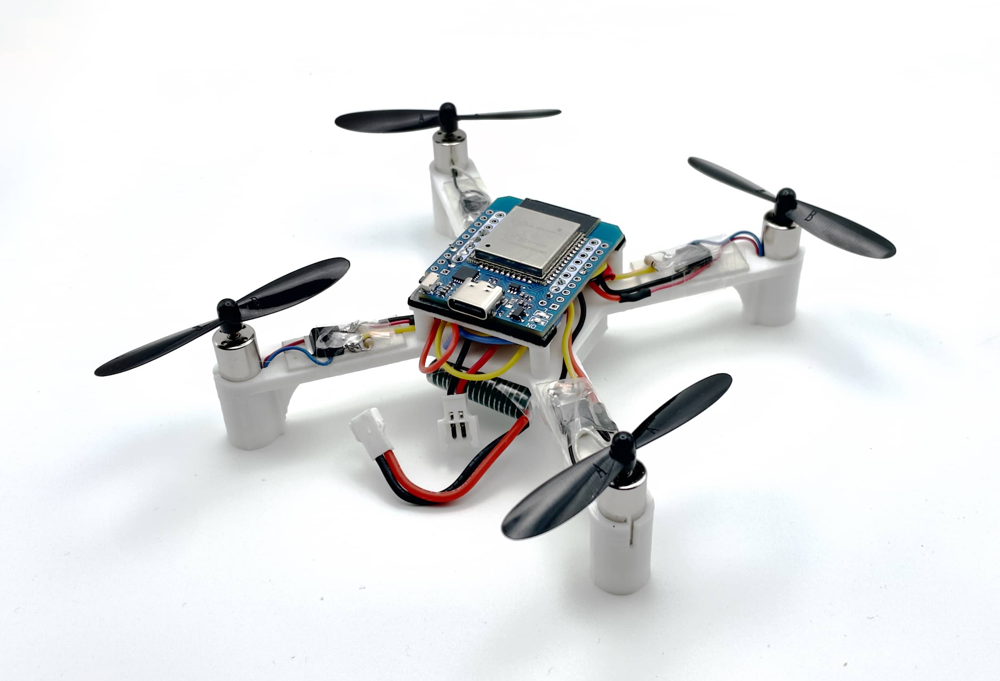</td>
    <td></td>
  </tr>
</table>

## Features

* Dedicated for education and research.
* Made from general-purpose components.
* Simple and clean source code in Arduino (<2k lines firmware).
* Control using USB gamepad, remote control or smartphone.
* Wi-Fi and MAVLink support.
* Wireless command line interface and analyzing.
* Precise simulation with Gazebo.
* Python library.
* Textbook on flight control theory and practice ([in development](https://quadcopter.dev)).
* *Position control (using external camera) and autonomous flights¹*.

*¹ — planned.*

## It actually flies

See detailed demo video: https://youtu.be/hT46CZ1CgC4.

Version 0 demo video: https://youtu.be/8GzzIQ3C6DQ.

Usage in education (RoboCamp): https://youtu.be/Wd3yaorjTx0.

See the [user builds gallery](docs/user.md):

<a href="docs/user.md">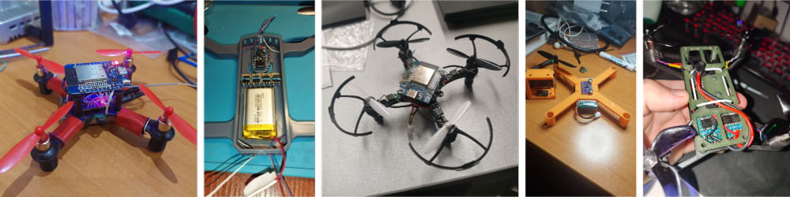</a>

## Simulation

The simulator is implemented using Gazebo and runs the original Arduino code:

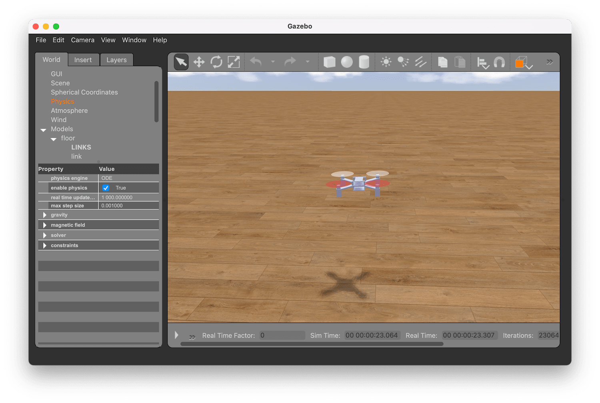

## Articles

* [Assembly instructions](docs/assembly.md).
* [Usage: build, setup and flight](docs/usage.md).
* [Troubleshooting](docs/troubleshooting.md).
* [Firmware architecture overview](docs/firmware.md).
* [Python library tutorial](tools/pyflix/README.md).
* [Log analysis](docs/log.md).
* [User builds gallery](docs/user.md).

## Components

|Type|Part|Image|Quantity|
|-|-|:-:|:-:|
|Microcontroller board|ESP32 Mini||1|
|IMU (and barometer²) board|GY‑91, MPU-9265 (or other MPU‑9250/MPU‑6500 board) ICM20948V2 (ICM‑20948)³ GY-521 (MPU-6050)³⁻¹| 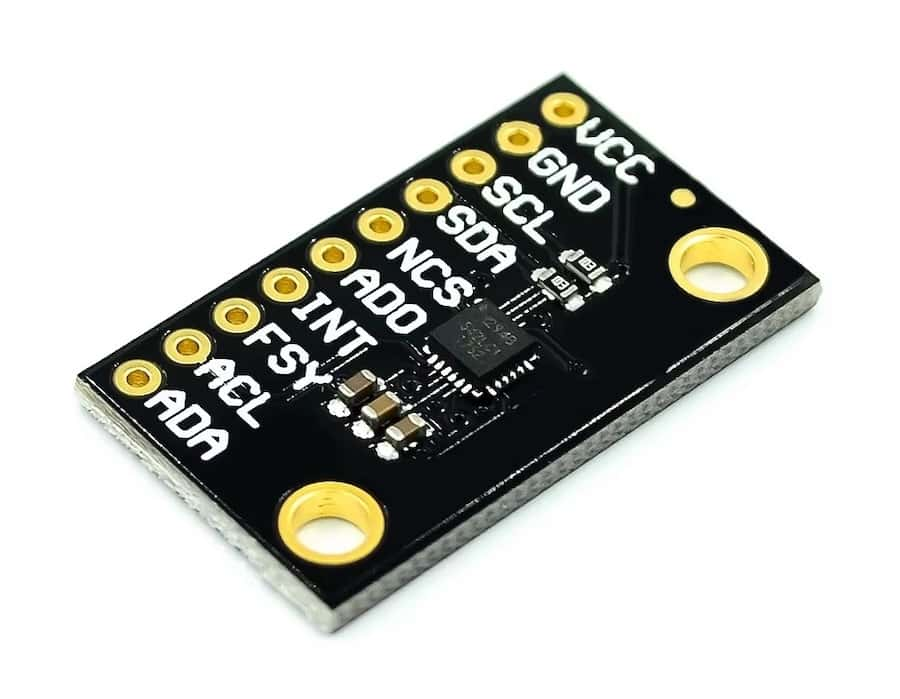 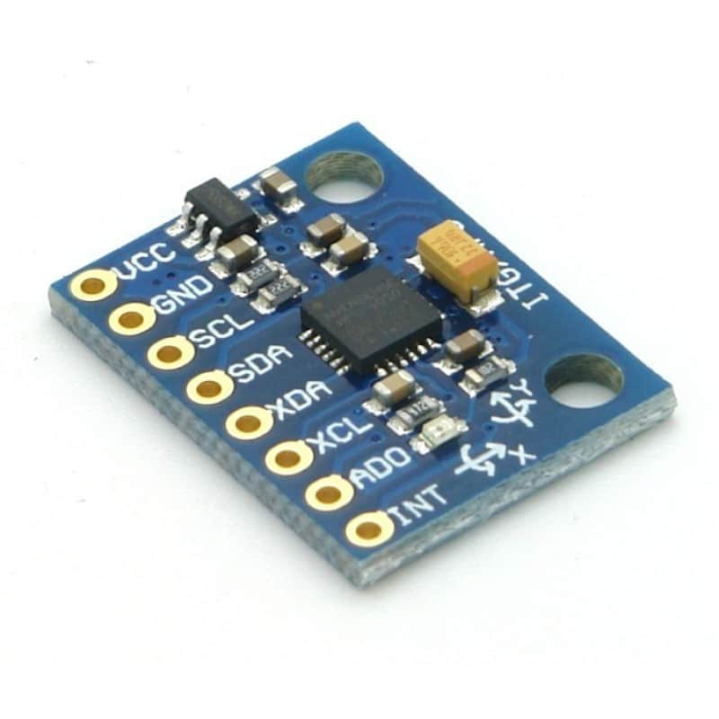|1|
|Buck-boost converter (recommended)|To be determined, output 5V or 3.3V, see [user-contributed schematics](https://miro.com/app/board/uXjVN-dTjoo=/?moveToWidget=3458764612179508274&cot=14)|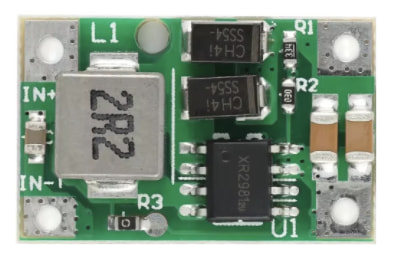|1|
|Motor|8520 3.7V brushed motor (shaft 0.8mm). Motor with exact 3.7V voltage is needed, not ranged working voltage (3.7V — 6V).||4|
|Propeller|Hubsan 55 mm||4|
|MOSFET (transistor)|100N03A or [analog](https://t.me/opensourcequadcopter/33)|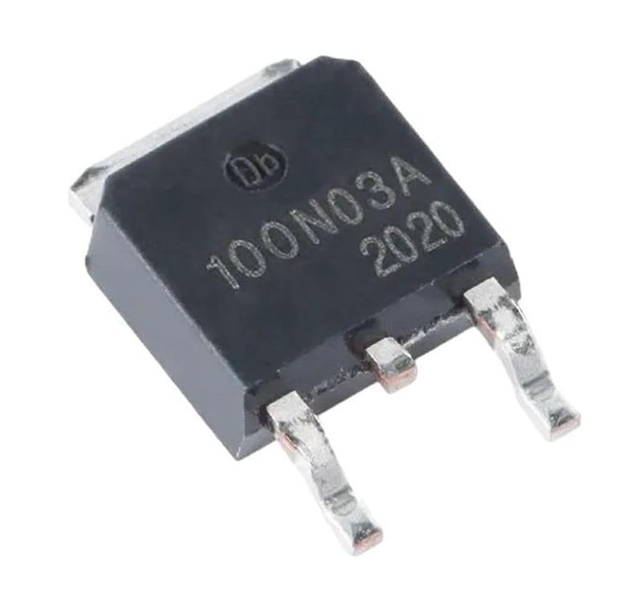|4|
|Pull-down resistor|10 kΩ|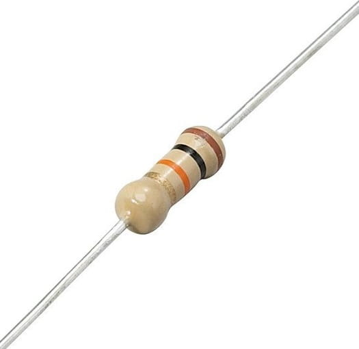|4|
|3.7V Li-Po battery|LW 952540 (or any compatible by the size)|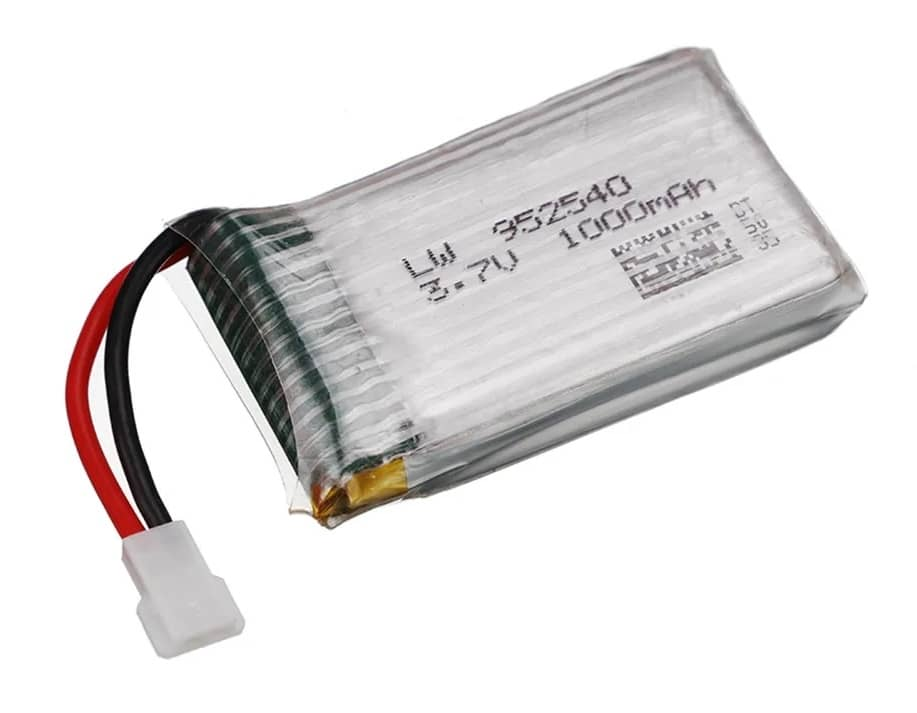|1|
|Battery connector cable|MX2.0 2P female|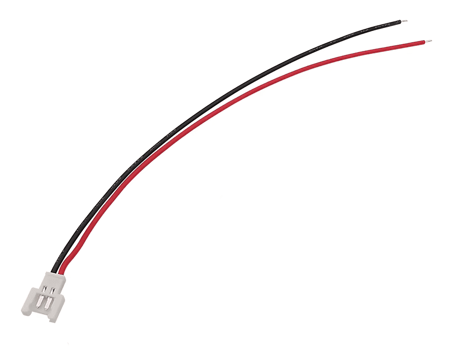|1|
|Li-Po Battery charger|Any||1|
|Screws for IMU board mounting|M3x5|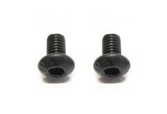|2|
|Screws for frame assembly|M1.4x5|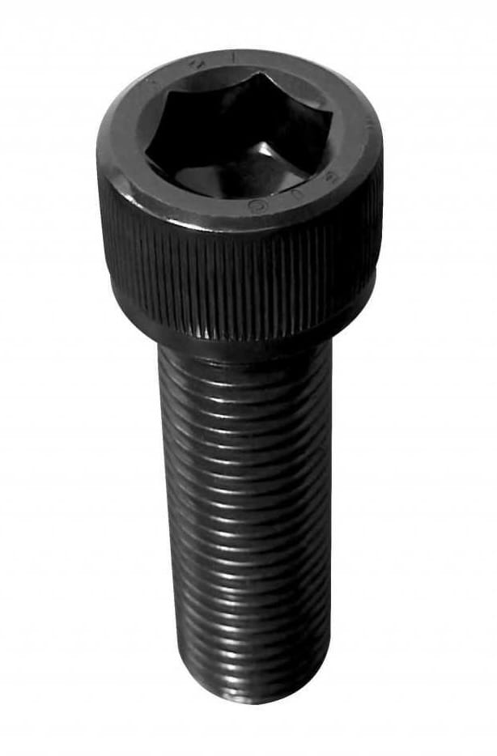|4|
|Frame main part|3D printed⁴: [`flix-frame-1.1.stl`](docs/assets/flix-frame-1.1.stl) [`flix-frame-1.1.step`](docs/assets/flix-frame-1.1.step) Recommended settings: layer 0.2 mm, line 0.4 mm, infill 100%.|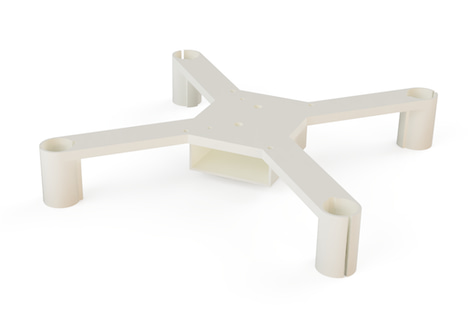|1|
|Frame top part|3D printed: [`esp32-holder.stl`](docs/assets/esp32-holder.stl) [`esp32-holder.step`](docs/assets/esp32-holder.step)|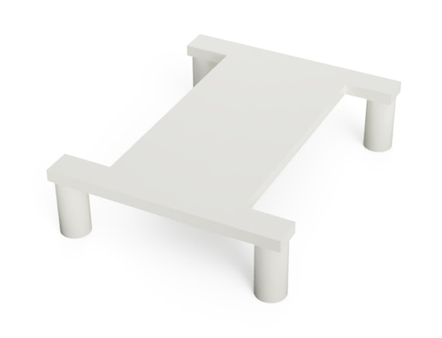|1|
|Washer for IMU board mounting|3D printed: [`washer-m3.stl`](docs/assets/washer-m3.stl) [`washer-m3.step`](docs/assets/washer-m3.step)|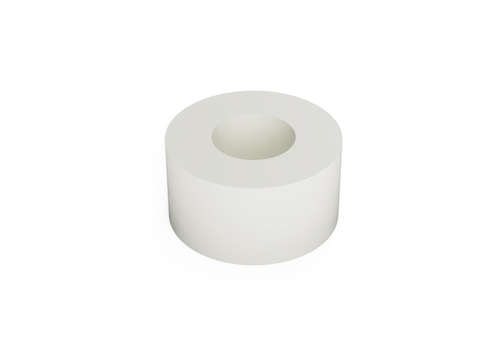|2|
|Controller (recommended)|CC2500 transmitter, like BetaFPV LiteRadio CC2500 (RC receiver/Wi-Fi). Two-sticks gamepad (Wi-Fi only) — see [recommended gamepads](https://docs.qgroundcontrol.com/master/en/qgc-user-guide/setup_view/joystick.html#supported-joysticks). Other⁵|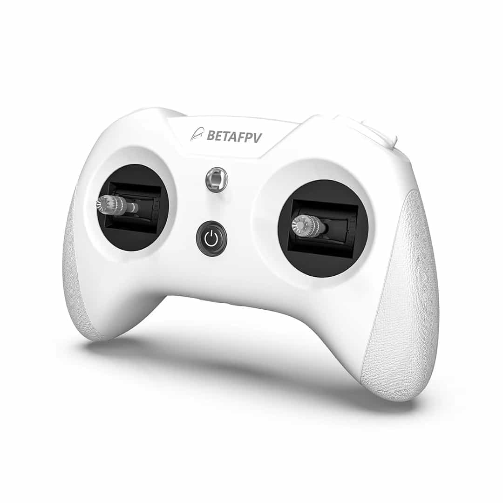|1|
|*RC receiver (optional)*|*DF500 or other⁵*||1|
|Wires|28 AWG recommended|||
|Tape, double-sided tape||||

*² — barometer is not used for now.* 
*³ — change `MPU9250` to `ICM20948` in `imu.ino` file if using ICM-20948 board.* 
*³⁻¹ — MPU-6050 supports I²C interface only (not recommended). To use it change IMU declaration to `MPU6050 IMU(Wire)`.* 
*⁴ — this frame is optimized for GY-91 board, if using other, the board mount holes positions should be modified.* 
*⁵ — you also may use any transmitter-receiver pair with SBUS interface.*

Tools required for assembly:

* 3D printer.
* Soldering iron.
* Solder wire (with flux).
* Screwdrivers.
* Multimeter.

Feel free to modify the design and or code, and create your own improved versions of Flix! Send your results to the [official Telegram chat](https://t.me/opensourcequadcopterchat), or directly to the author ([E-mail](mailto:okalachev@gmail.com), [Telegram](https://t.me/okalachev)).

## Schematics

### Simplified connection diagram

*(Dashed is optional).*

Motor connection scheme:

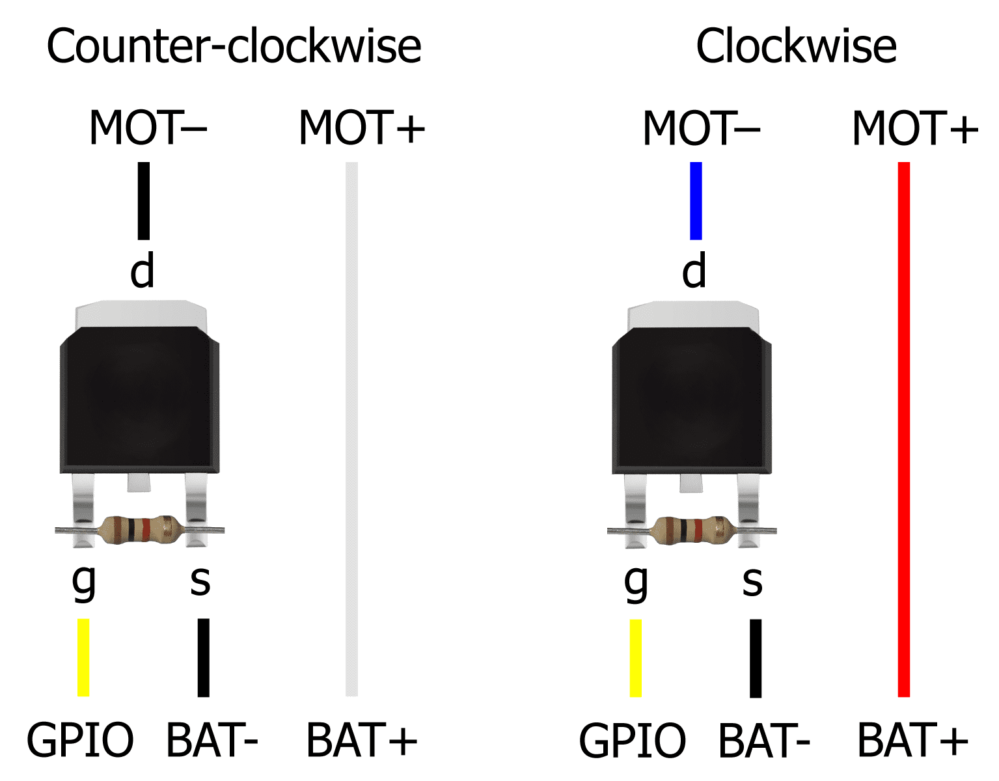

You can see a user-contributed [variant of complete circuit diagram](https://miro.com/app/board/uXjVN-dTjoo=/?moveToWidget=3458764612338222067&cot=14) of the drone.

See [assembly guide](docs/assembly.md) for instructions on assembling the drone.

### Notes

* Power ESP32 Mini with Li-Po battery using VCC (+) and GND (-) pins.
* Connect the IMU board to the ESP32 Mini using VSPI, power it using 3.3V and GND pins:

  |IMU pin|ESP32 pin|
  |-|-|
  |GND|GND|
  |3.3V|3.3V|
  |SCL *(SCK)*|SVP (GPIO18)|
  |SDA *(MOSI)*|GPIO23|
  |SAO *(MISO)*|GPIO19|
  |NCS|GPIO5|

* Solder pull-down resistors to the MOSFETs.
* Connect the motors to the ESP32 Mini using MOSFETs, by following scheme:

  |Motor|Position|Direction|Wires|GPIO|
  |-|-|-|-|-|
  |Motor 0|Rear left|Counter-clockwise|Black & White|GPIO12 (*TDI*)|
  |Motor 1|Rear right|Clockwise|Blue & Red|GPIO13 (*TCK*)|
  |Motor 2|Front right|Counter-clockwise|Black & White|GPIO14 (*TMS*)|
  |Motor 3|Front left|Clockwise|Blue & Red|GPIO15 (*TD0*)|

  Counter-clockwise motors have black and white wires and clockwise motors have blue and red wires.

* Optionally connect the RC receiver to the ESP32's UART2:

  |Receiver pin|ESP32 pin|
  |-|-|
  |GND|GND|
  |VIN|VCC (or 3.3V depending on the receiver)|
  |Signal (TX)|GPIO4⁶|

*⁶ — UART2 RX pin was [changed](https://docs.espressif.com/projects/arduino-esp32/en/latest/migration_guides/2.x_to_3.0.html#id14) to GPIO4 in Arduino ESP32 core 3.0.*

### IMU placement

Default IMU orientation in the code is **LFD** (Left-Forward-Down):

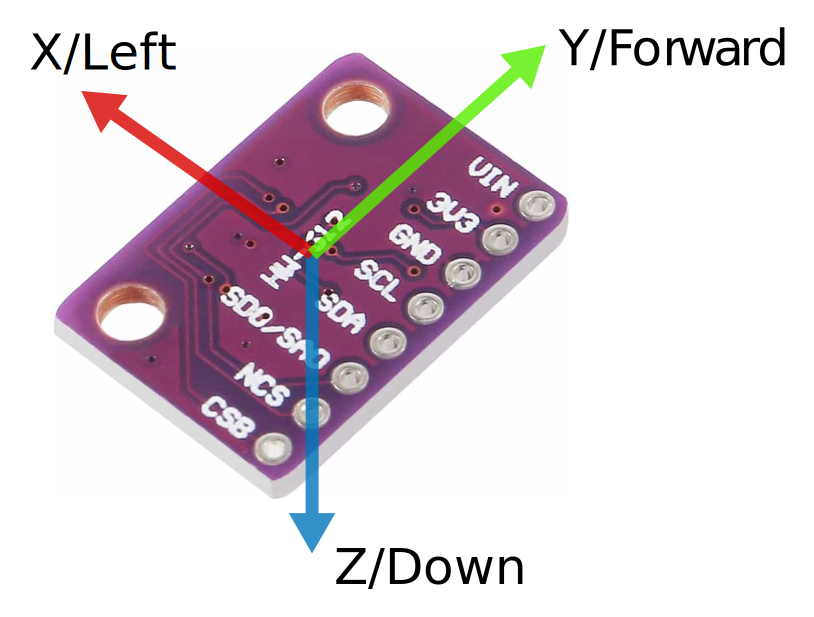

In case of using other IMU orientation, modify the `rotateIMU` function in the `imu.ino` file.

See [FlixPeriph documentation](https://github.com/okalachev/flixperiph?tab=readme-ov-file#imu-axes-orientation) to learn axis orientation of other IMU boards.

## Materials

Subscribe to the Telegram channel on developing the drone and the flight controller (in Russian): https://t.me/opensourcequadcopter.

Join the official Telegram chat: https://t.me/opensourcequadcopterchat.

Detailed article on Habr.com about the development of the drone (in Russian): https://habr.com/ru/articles/814127/.

See the information on the obsolete version 0 in the [corresponding article](docs/version0.md).

## Disclaimer

This is a fun DIY project, and I hope you find it interesting and useful. However, it's not easy to assemble and set up, and it's provided "as is" without any warranties. There’s no guarantee that it will work perfectly — or even work at all.

⚠️ The author is not responsible for any damage, injury, or loss resulting from the use of this project. Use at your own risk!
