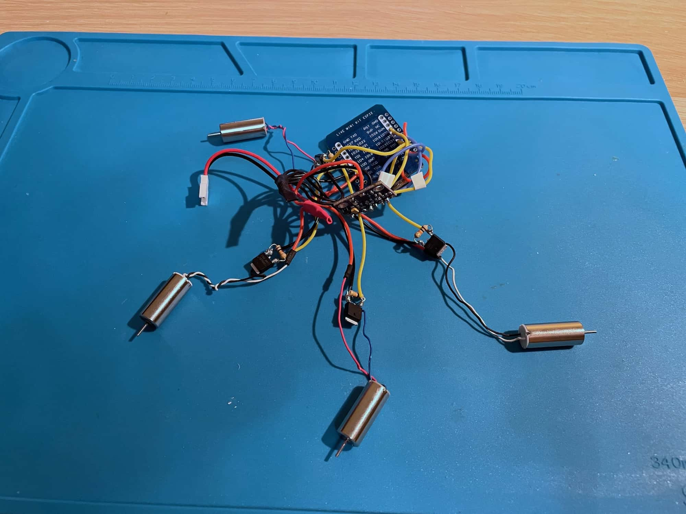
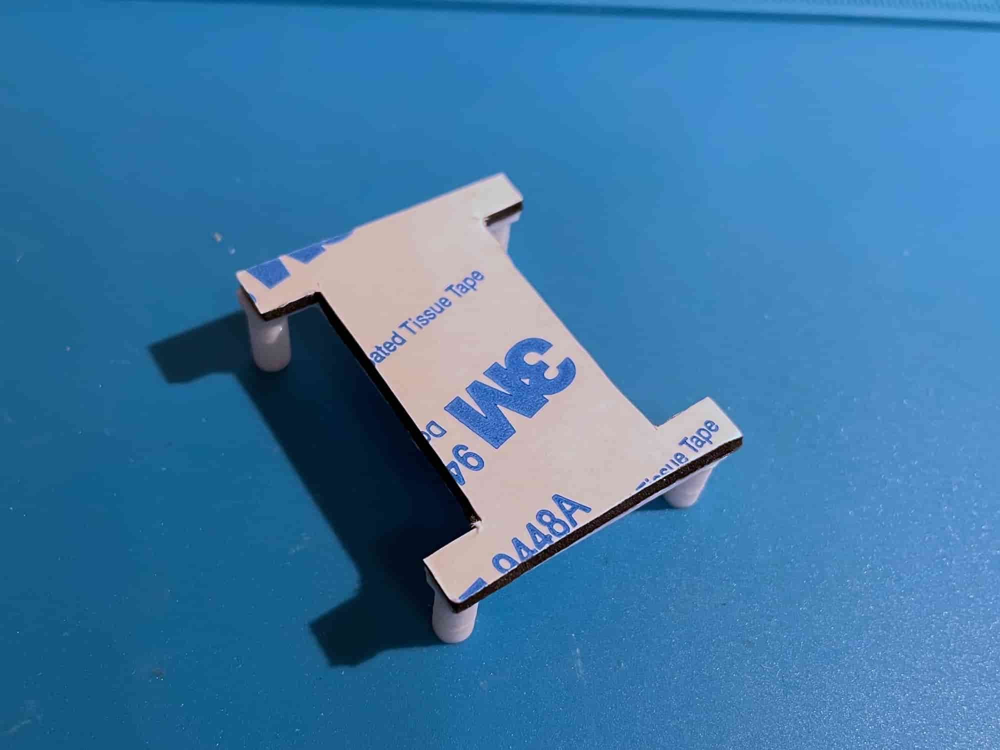
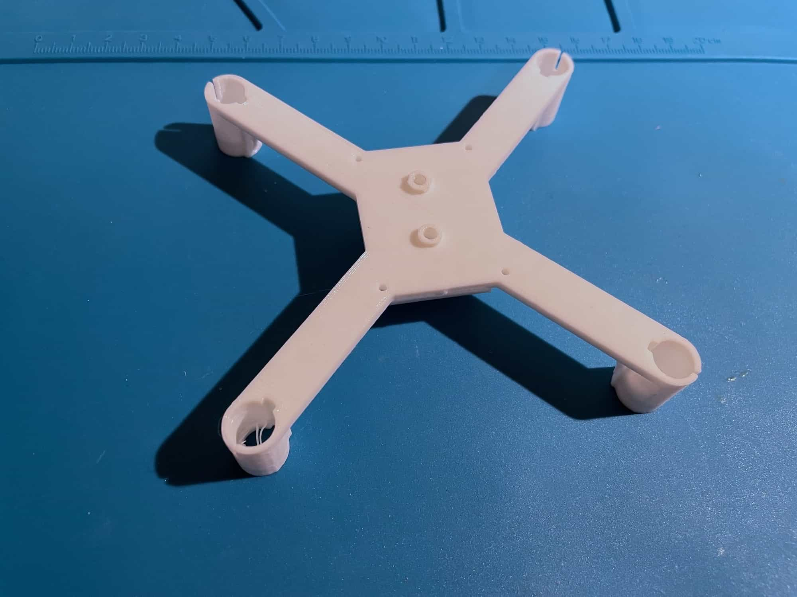
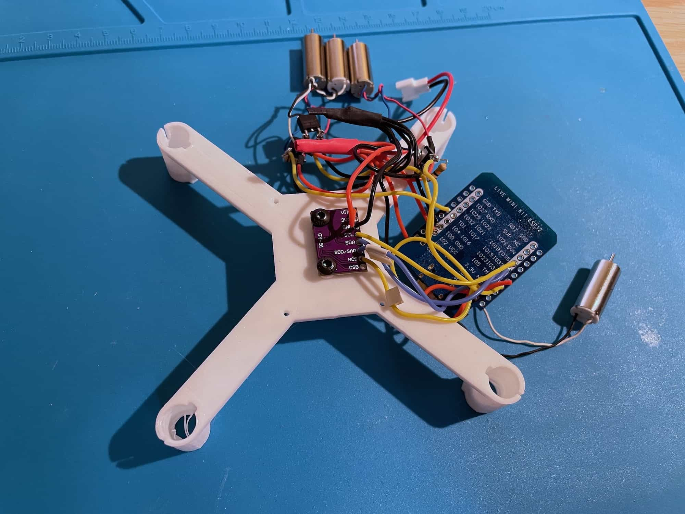
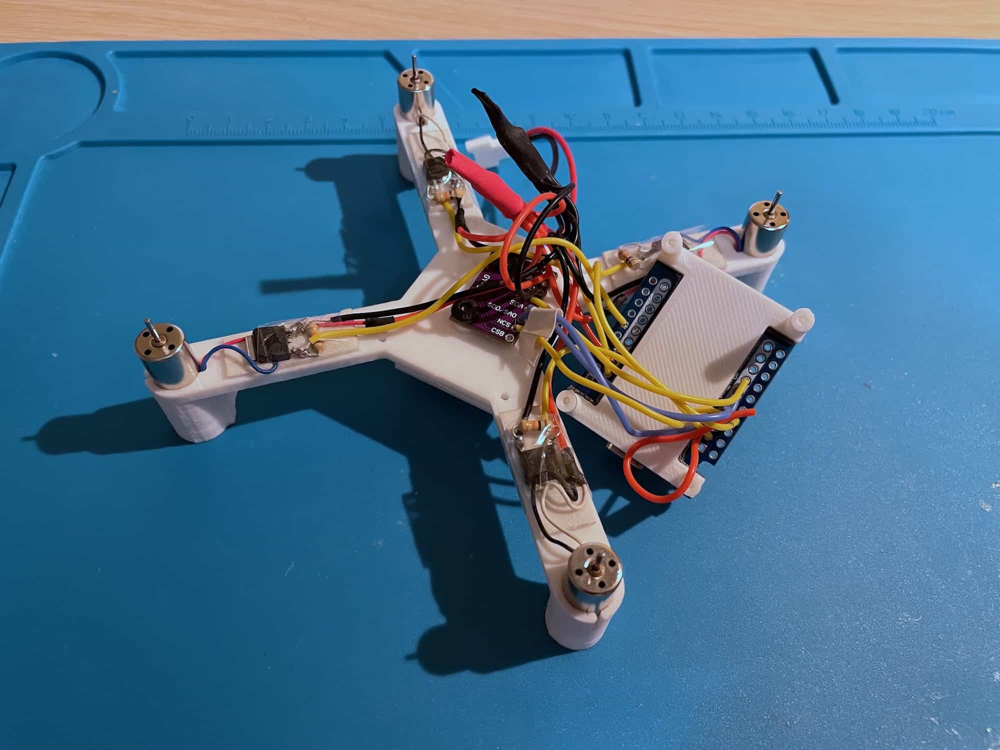
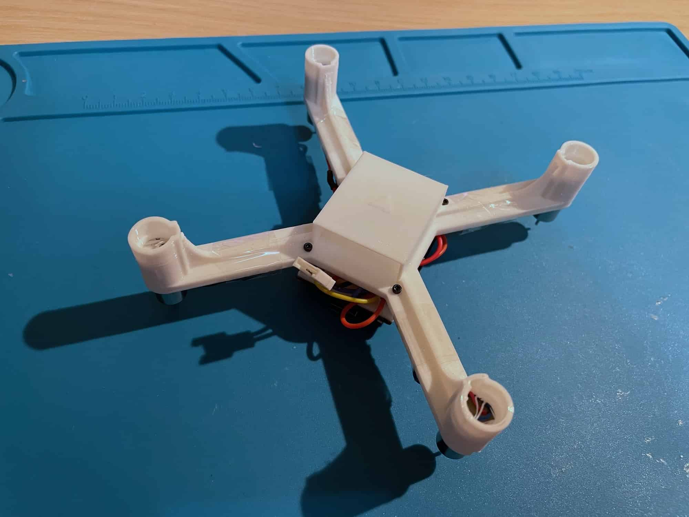
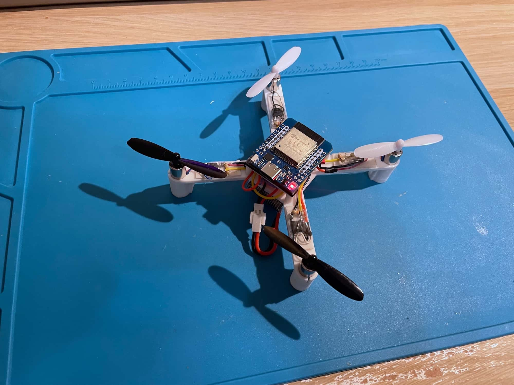

# Brief assembly guide

Soldered components ([schematics variant](https://miro.com/app/board/uXjVN-dTjoo=/?moveToWidget=3458764612338222067&cot=14)):

 Use double-sided tape to attach ESP32 to the top frame part (ESP32 holder):

 Use two washers to screw the IMU board to the frame:

 Screw the IMU with M3x5 screws as shown:

 Install the motors, attach MOSFETs to the frame using tape:

 Screw the ESP32 holder with M1.4x5 screws to the frame:

 Assembled drone:

