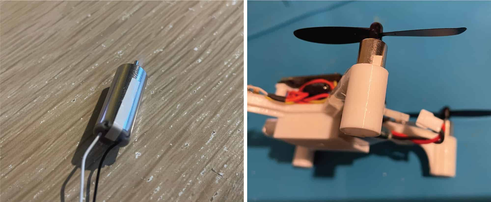

# Brief assembly guide

Soldered components ([schematics variant](https://miro.com/app/board/uXjVN-dTjoo=/?moveToWidget=3458764612338222067&cot=14)):

 Use double-sided tape to attach ESP32 to the top frame part (ESP32 holder):

 Use two washers to screw the IMU board to the frame:

 Screw the IMU with M3x5 screws as shown:

 Install the motors, attach MOSFETs to the frame using tape:

 Screw the ESP32 holder with M1.4x5 screws to the frame:

 Assembled drone:

## Motor directions

> [!WARNING]
> The drone above is an early build, and it has **inversed** motor directions scheme. The photos only illustrate the assembly process in general.

Use standard motor directions scheme:

Motors connection table:

|Motor|Position|Direction|Prop type|Motor wires|GPIO|
|-|-|-|-|-|-|
|Motor 0|Rear left|Counter-clockwise|B|Black & White|GPIO12 (*TDI*)|
|Motor 1|Rear right|Clockwise|A|Blue & Red|GPIO13 (*TCK*)|
|Motor 2|Front right|Counter-clockwise|B|Black & White|GPIO14 (*TMS*)|
|Motor 3|Front left|Clockwise|A|Blue & Red|GPIO15 (*TD0*)|

## Motors tightening

Motors should be installed very tightly — any vibration may lead to bad attitude estimation and unstable flight. If motors are loose, use tiny tape pieces to fix them tightly as shown below:

