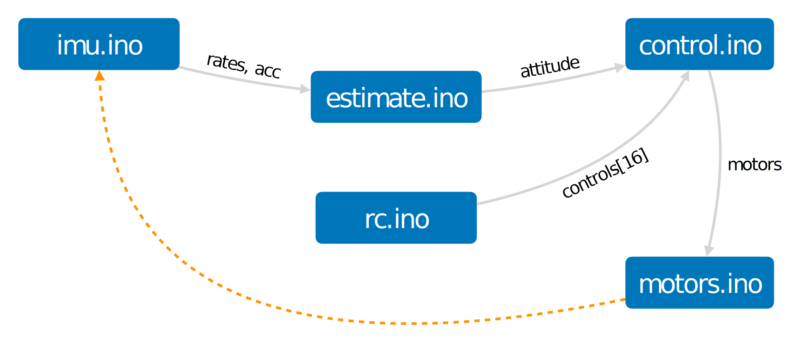

# Firmware overview

The firmware is a regular Arduino sketch, and it follows the classic Arduino one-threaded design. The initialization code is in the `setup()` function, and the main loop is in the `loop()` function. The sketch includes several files, each responsible for a specific subsystem.

## Dataflow

The main loop is running at 1000 Hz. All the dataflow goes through global variables (for simplicity):

* `t` *(double)* — current step time, *s*.
* `dt` *(float)* — time delta between the current and previous steps, *s*.
* `gyro` *(Vector)* — data from the gyroscope, *rad/s*.
* `acc` *(Vector)* — acceleration data from the accelerometer, *m/s2*.
* `rates` *(Vector)* — filtered angular rates, *rad/s*.
* `attitude` *(Quaternion)* — estimated attitude (orientation) of drone.
* `controlRoll`, `controlPitch`, ... *(float[])* — pilot control inputs, range [-1, 1].
* `motors` *(float[])* — motor outputs, range [0, 1].

## Source files

Firmware source files are located in `flix` directory. The core files are:

* [`flix.ino`](../flix/flix.ino) — Arduino sketch main file, entry point.Includes some global variable definitions and the main loop.
* [`imu.ino`](../flix/imu.ino) — reading data from the IMU sensor (gyroscope and accelerometer), IMU calibration.
* [`rc.ino`](../flix/rc.ino) — reading data from the RC receiver, RC calibration.
* [`estimate.ino`](../flix/estimate.ino) — attitude estimation, complementary filter.
* [`control.ino`](../flix/control.ino) — control subsystem, three-dimensional two-level cascade PID controller.
* [`motors.ino`](../flix/motors.ino) — PWM motor output control.
* [`mavlink.ino`](../flix/mavlink.ino) — interaction with QGroundControl or [pyflix](../tools/pyflix) via MAVLink protocol.

Utility files:

* [`vector.h`](../flix/vector.h), [`quaternion.h`](../flix/quaternion.h) — vector and quaternion libraries.
* [`pid.h`](../flix/pid.h) — generic PID controller.
* [`lpf.h`](../flix/lpf.h) — generic low-pass filter.

### Control subsystem

Pilot inputs are interpreted in `interpretControls()`, and then converted to the *control command*, which consists of the following:

* `attitudeTarget` *(Quaternion)* — target attitude of the drone.
* `ratesTarget` *(Vector)* — target angular rates, *rad/s*.
* `ratesExtra` *(Vector)* — additional (feed-forward) angular rates , used for yaw rate control in STAB mode, *rad/s*.
* `torqueTarget` *(Vector)* — target torque, range [-1, 1].
* `thrustTarget` *(float)* — collective thrust target, range [0, 1].

Control command is processed in `controlAttitude()`, `controlRates()`, `controlTorque()` functions. Each function may be skipped if the corresponding target is set to `NAN`.

Armed state is stored in `armed` variable, and current mode is stored in `mode` variable.

## Building

See build instructions in [usage.md](usage.md).
