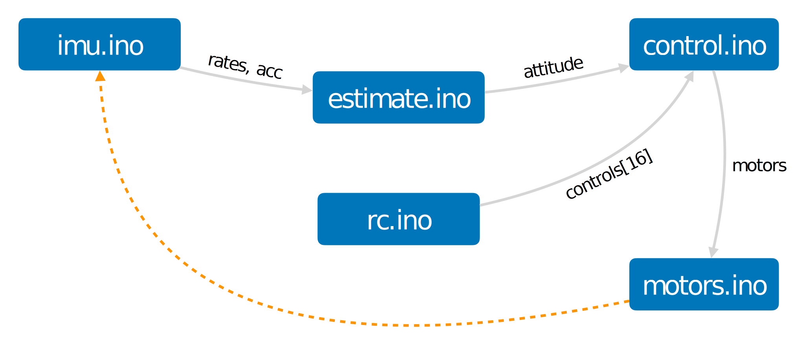

# Firmware overview

The firmware is a regular Arduino sketch, and it follows the classic Arduino one-threaded design. The initialization code is in the `setup()` function, and the main loop is in the `loop()` function. The sketch includes several files, each responsible for a specific subsystem.

## Dataflow



The main loop is running at 1000 Hz. The dataflow goes through global variables, including:

* `t` *(float)* — current step time, *s*.
* `dt` *(float)* — time delta between the current and previous steps, *s*.
* `gyro` *(Vector)* — data from the gyroscope, *rad/s*.
* `acc` *(Vector)* — acceleration data from the accelerometer, *m/s<sup>2</sup>*.
* `rates` *(Vector)* — filtered angular rates, *rad/s*.
* `attitude` *(Quaternion)* — estimated attitude (orientation) of drone.
* `controlRoll`, `controlPitch`, `controlYaw`, `controlThrottle`, `controlMode` *(float)* — pilot control inputs, range [-1, 1].
* `motors` *(float[4])* — motor outputs, range [0, 1].

## Source files

Firmware source files are located in `flix` directory.

* [`flix.ino`](../flix/flix.ino) — Arduino sketch main file, entry point.Includes some global variable definitions and the main loop.
* [`imu.ino`](../flix/imu.ino) — reading data from the IMU sensor (gyroscope and accelerometer), IMU calibration.
* [`rc.ino`](../flix/rc.ino) — reading data from the RC receiver, RC calibration.
* [`estimate.ino`](../flix/estimate.ino) — attitude estimation, complementary filter.
* [`control.ino`](../flix/control.ino) — control subsystem, three-dimensional two-level cascade PID controller.
* [`motors.ino`](../flix/motors.ino) — PWM motor output control.
* [`mavlink.ino`](../flix/mavlink.ino) — interaction with QGroundControl or [pyflix](../tools/pyflix) via MAVLink protocol.
* [`cli.ino`](../flix/cli.ino) — serial and MAVLink console.

Utility files:

* [`vector.h`](../flix/vector.h), [`quaternion.h`](../flix/quaternion.h) — vector and quaternion libraries.
* [`pid.h`](../flix/pid.h) — generic PID controller.
* [`lpf.h`](../flix/lpf.h) — generic low-pass filter.

### Control subsystem

Pilot inputs are interpreted in `interpretControls()`, and then converted to the **control command**, which consists of the following:

* `attitudeTarget` *(Quaternion)* — target attitude of the drone.
* `ratesTarget` *(Vector)* — target angular rates, *rad/s*.
* `ratesExtra` *(Vector)* — additional (feed-forward) angular rates, used for yaw rate control in STAB mode, *rad/s*.
* `torqueTarget` *(Vector)* — target torque, range [-1, 1].
* `thrustTarget` *(float)* — collective motor thrust target, range [0, 1].

Control command is handled in `controlAttitude()`, `controlRates()`, `controlTorque()` functions. Each function may be skipped if the corresponding control target is set to `NAN`.


Armed state is stored in `armed` variable, and current mode is stored in `mode` variable.

### Console

To write into the console, `print()` function is used. This function sends data both to the Serial console and to the MAVLink console (which can be accessed wirelessly in QGroundControl). The function supports formatting:

```cpp
print("Test value: %.2f\n", testValue);
```

In order to add a console command, modify the `doCommand()` function in `cli.ino` file.

> [!IMPORTANT]
> Avoid using delays in in-flight commands, it will **crash** the drone! (The design is one-threaded.)
>
> For on-the-ground commands, use `pause()` function, instead of `delay()`. This function allows to pause in a way that MAVLink connection will continue working.

### Parameter subsystem

Parameters subsystem (`parameters.ino`) uses standard [Preferences.h](https://docs.espressif.com/projects/arduino-esp32/en/latest/tutorials/preferences.html) ESP32 library to store parameters in non-volatile memory. Each parameter is a regular global variable, which is registered in the `parameters` array.

To add a new parameter:

1. Define a global variable for the parameter, two types are supported: `float` and `int`.
2. Add an entry to the `parameters` array, with the parameter name, a pointer to the variable, and optionally a callback function to call when the parameter is changed.
3. Everything else will be handled automatically.

See examples of adding new parameters in commits: [c434107](https://github.com/okalachev/flix/commit/c434107), [a687303](https://github.com/okalachev/flix/commit/a687303).

## Adding a subsystem

To add a new subsystem:

1. Create a new `*.ino` file for your subsystem.
2. Define setup and loop functions for the subsystem, for example `setupMySubsystem()` and `loopMySubsystem()`.
3. Use `Rate` class if you need to limit the loop frequency, for example:

    ```cpp
    Rate mySubsystemRate(100); // 100 Hz

    void loopMySubsystem() {
    	if (!mySubsystemRate) return;
    	// Do something...
    }
4. Add setup and loop calls in to `setup()` and `loop()` functions in `flix.ino`.

## Building the firmware

See build instructions in [usage.md](usage.md).
