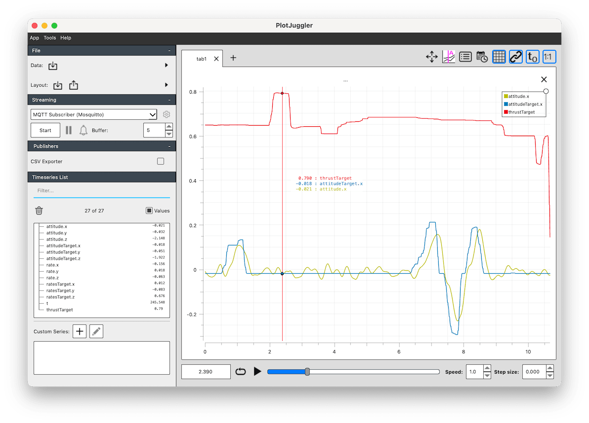
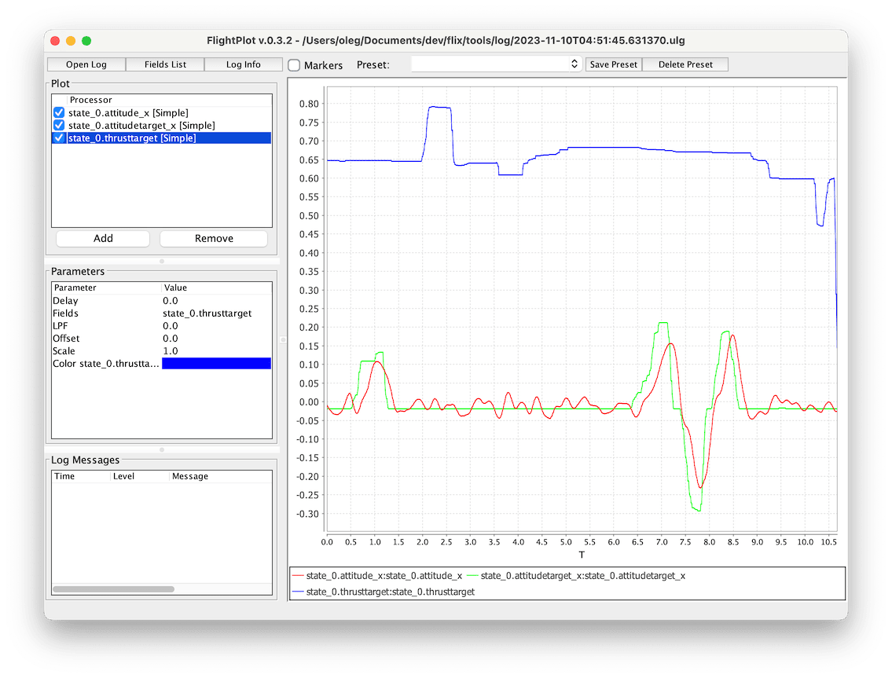
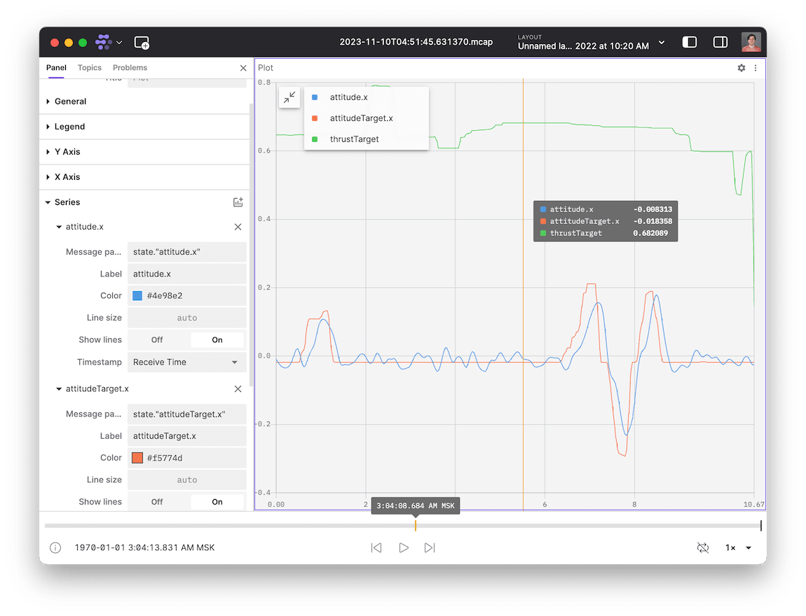

# Log analysis

Flix quadcopter uses RAM to store flight log data. The default log capacity is 10 seconds at 100 Hz. This configuration can be adjusted in the `log.ino` file.

To perform log analysis, you need to download the log right after the flight without powering off the drone. Then you can use several tools to analyze the log data.

## Log download

To download the log, connect the ESP32 using USB right after the flight and run the following command:

```bash
make log
```

Logs are stored in `tools/log/*.csv` files.

## Analysis

### PlotJuggler

The recommended tool for log analysis is PlotJuggler.



1. Install PlotJuggler using the [official instructions](https://github.com/facontidavide/PlotJuggler?tab=readme-ov-file#installation).

2. Run PlotJuggler and drag'n'drop the downloaded log file there. Choose `t` column to be used as X axis.

   You can open the most recent downloaded file using the command:

   ```bash
   make plot
   ```

   You can perform both log download and run PlotJuggler in one command:

   ```bash
   make log plot
   ```

### FlightPlot

FlightPlot is a powerful tool for analyzing logs in [ULog format](https://docs.px4.io/main/en/dev_log/ulog_file_format.html). This format is used in PX4 and ArduPilot flight software.



1. [Install FlightPlot](https://github.com/PX4/FlightPlot).
2. Flix repository contains a tool for converting CSV logs to ULog format. Build the tool using [the instructions](../tools/csv_to_ulog/README.md) and convert the log you want to analyze.
3. Run FlightPlot and drag'n'drop the converted ULog-file there.

### Foxglove Studio

Foxglove is a tool for visualizing and analyzing robotics data with very rich functionality. It can import various formats, but mainly focuses on its own format, called [MCAP](https://mcap.dev).



1. Install Foxglove Studio from the [official website](https://foxglove.dev/download).

2. Flix repository contains a tool for converting CSV logs to MCAP format. First, install its dependencies:

   ```bash
   cd tools
   pip install -r requirements.txt
   ```

3. Convert the log you want to analyze:

   ```bash
   csv_to_mcap.py log_file.csv
   ```

4. Open the log in Foxglove Studio using *Open local file* command.
