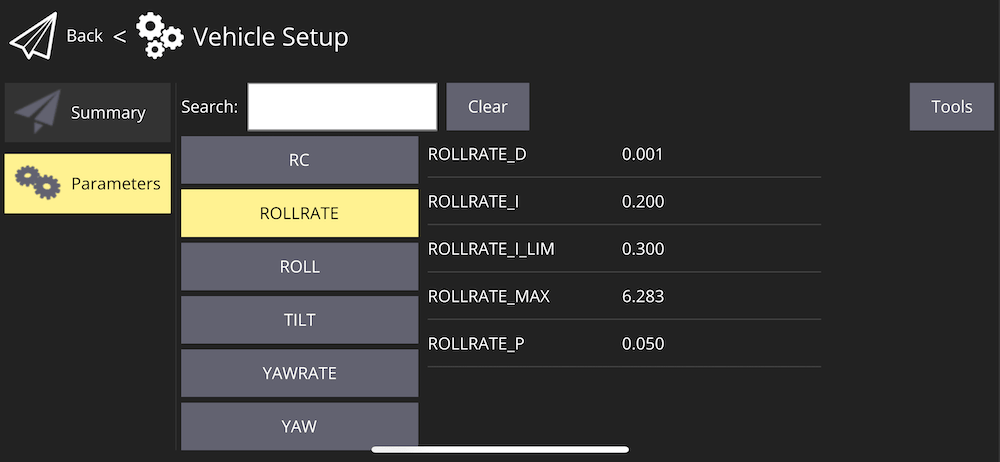
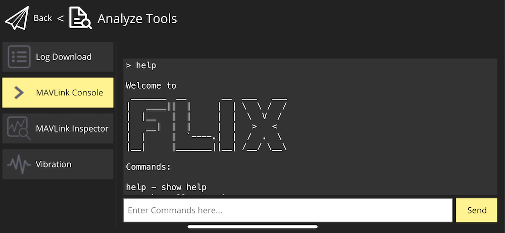

# Usage: build, setup and flight

To use Flix, you need to build the firmware and upload it to the ESP32 board. For simulation, you need to build and run the simulator.

For the start, clone the repository using git:

```bash
git clone https://github.com/okalachev/flix.git
cd flix
```

## Simulation

### Ubuntu

The latest version of Ubuntu supported by Gazebo 11 simulator is 22.04. If you have a newer version, consider using a virtual machine.

1. Install Arduino CLI:

   ```bash
   curl -fsSL https://raw.githubusercontent.com/arduino/arduino-cli/master/install.sh | BINDIR=~/.local/bin sh
   ```

2. Install Gazebo 11:

   ```bash
   curl -sSL http://get.gazebosim.org | sh
   ```

   Set up your Gazebo environment variables:

   ```bash
   echo "source /usr/share/gazebo/setup.sh" >> ~/.bashrc
   source ~/.bashrc
   ```

3. Install SDL2 and other dependencies:

   ```bash
   sudo apt-get update && sudo apt-get install build-essential libsdl2-dev
   ```

4. Add your user to the `input` group to enable joystick support (you need to re-login after this command):

   ```bash
   sudo usermod -a -G input $USER
   ```

5. Run the simulation:

   ```bash
   make simulator
   ```

### macOS

1. Install Homebrew package manager, if you don't have it installed:

   ```bash
   /bin/bash -c "$(curl -fsSL https://raw.githubusercontent.com/Homebrew/install/HEAD/install.sh)"
   ```

2. Install Arduino CLI, Gazebo 11 and SDL2:

   ```bash
   brew tap osrf/simulation
   brew install arduino-cli
   brew install gazebo11
   brew install sdl2
   ```

   Set up your Gazebo environment variables:

   ```bash
   echo "source /opt/homebrew/share/gazebo/setup.sh" >> ~/.zshrc
   source ~/.zshrc
   ```

3. Run the simulation:

   ```bash
   make simulator
   ```

### Setup

#### Control with smartphone

1. Install [QGroundControl mobile app](https://docs.qgroundcontrol.com/master/en/qgc-user-guide/getting_started/download_and_install.html#android) on your smartphone. For **iOS**, use [QGroundControl build from TAJISOFT](https://apps.apple.com/ru/app/qgc-from-tajisoft/id1618653051).
2. Connect your smartphone to the same Wi-Fi network as the machine running the simulator.
3. If you're using a virtual machine, make sure that its network is set to the **bridged** mode with Wi-Fi adapter selected.
4. Run the simulation.
5. Open QGroundControl app. It should connect and begin showing the virtual drone's telemetry automatically.
6. Go to the settings and enable *Virtual Joystick*. *Auto-Center Throttle* setting **should be disabled**.
7. Use the virtual joystick to fly the drone!

#### Control with USB remote control

1. Connect your USB remote control to the machine running the simulator.
2. Run the simulation.
3. Calibrate the RC using `cr` command in the command line interface.
4. Run the simulation again.
5. Use the USB remote control to fly the drone!

## Firmware

### Arduino IDE (Windows, Linux, macOS)

1. Install [Arduino IDE](https://www.arduino.cc/en/software) (version 2 is recommended).
2. Windows users might need to install [USB to UART bridge driver from Silicon Labs](https://www.silabs.com/developers/usb-to-uart-bridge-vcp-drivers).
3. Install ESP32 core, version 3.2.0. See the [official Espressif's instructions](https://docs.espressif.com/projects/arduino-esp32/en/latest/installing.html#installing-using-arduino-ide) on installing ESP32 Core in Arduino IDE.
4. Install the following libraries using [Library Manager](https://docs.arduino.cc/software/ide-v2/tutorials/ide-v2-installing-a-library):
   * `FlixPeriph`, the latest version.
   * `MAVLink`, version 2.0.16.
5. Clone the project using git or [download the source code as a ZIP archive](https://codeload.github.com/okalachev/flix/zip/refs/heads/master).
6. Open the downloaded Arduino sketch `flix/flix.ino` in Arduino IDE.
7. Connect your ESP32 board to the computer and choose correct board type in Arduino IDE (*WEMOS D1 MINI ESP32* for ESP32 Mini) and the port.
8. [Build and upload](https://docs.arduino.cc/software/ide-v2/tutorials/getting-started/ide-v2-uploading-a-sketch) the firmware using Arduino IDE.

### Command line (Windows, Linux, macOS)

1. [Install Arduino CLI](https://arduino.github.io/arduino-cli/installation/).

   On Linux, use:

   ```bash
   curl -fsSL https://raw.githubusercontent.com/arduino/arduino-cli/master/install.sh | BINDIR=~/.local/bin sh
   ```

2. Windows users might need to install [USB to UART bridge driver from Silicon Labs](https://www.silabs.com/developers/usb-to-uart-bridge-vcp-drivers).
3. Compile the firmware using `make`. Arduino dependencies will be installed automatically:

   ```bash
   make
   ```

   You can flash the firmware to the board using command:

   ```bash
   make upload
   ```

   You can also compile the firmware, upload it and start serial port monitoring using command:

   ```bash
   make upload monitor
   ```

See other available Make commands in the [Makefile](../Makefile).

> [!TIP]
> You can test the firmware on a bare ESP32 board without connecting IMU and other peripherals. The Wi-Fi network `flix` should appear and all the basic functionality including CLI and QGroundControl connection should work.

### Setup

Before flight you need to calibrate the accelerometer:

1. Open Serial Monitor in Arduino IDE (or use `make monitor` command in the command line).
2. Type `ca` command there and follow the instructions.

#### Control with smartphone

1. Install [QGroundControl mobile app](https://docs.qgroundcontrol.com/master/en/qgc-user-guide/getting_started/download_and_install.html#android) on your smartphone.
2. Power the drone using the battery.
3. Connect your smartphone to the appeared `flix` Wi-Fi network (password: `flixwifi`).
4. Open QGroundControl app. It should connect and begin showing the drone's telemetry automatically.
5. Go to the settings and enable *Virtual Joystick*. *Auto-Center Throttle* setting **should be disabled**.
6. Use the virtual joystick to fly the drone!

> [!TIP]
> Decrease `TILT_MAX` parameter when flying using the smartphone to make the controls less sensitive.

#### Control with remote control

Before flight using remote control, you need to calibrate it:

1. Open Serial Monitor in Arduino IDE (or use `make monitor` command in the command line).
2. Type `cr` command there and follow the instructions.
3. Use the remote control to fly the drone!

#### Control with USB remote control (Wi-Fi)

If your drone doesn't have RC receiver installed, you can use USB remote control and QGroundControl app to fly it.

1. Install [QGroundControl](https://docs.qgroundcontrol.com/master/en/qgc-user-guide/getting_started/download_and_install.html) app on your computer.
2. Connect your USB remote control to the computer.
3. Power up the drone.
4. Connect your computer to the appeared `flix` Wi-Fi network (password: `flixwifi`).
5. Launch QGroundControl app. It should connect and begin showing the drone's telemetry automatically.
6. Go the the QGroundControl menu ⇒ *Vehicle Setup* ⇒ *Joystick*. Calibrate you USB remote control there.
7. Use the USB remote control to fly the drone!

> [!NOTE]
> If something goes wrong, go to the [Troubleshooting](troubleshooting.md) article.

## Flight

For both virtual sticks and a physical joystick, the default control scheme is left stick for throttle and yaw and right stick for pitch and roll:


### Arming and disarming

To start the motors, you should **arm** the drone. To do that, move the left stick to the bottom right corner:


After that, the motors **will start spinning** at low speed, indicating that the drone is armed and ready to fly.

When finished flying, **disarm** the drone, moving the left stick to the bottom left corner:


### Flight modes

Flight mode is changed using mode switch on the remote control or using the command line.

#### STAB

The default mode is *STAB*. In this mode, the drone stabilizes its attitude (orientation). The left stick controls throttle and yaw rate, the right stick controls pitch and roll angles.

> [!IMPORTANT]
> The drone doesn't stabilize its position, so slight drift is possible. The pilot should compensate it manually.

#### ACRO

In this mode, the pilot controls the angular rates. This control method is difficult to fly and mostly used in FPV racing.

#### MANUAL

Manual mode disables all the stabilization, and the pilot inputs are passed directly to the motors. This mode is intended for testing and demonstration purposes only, and basically the drone **cannot fly in this mode**.

#### AUTO

In this mode, the pilot inputs are ignored (except the mode switch, if configured). The drone can be controlled using [pyflix](../tools/pyflix/) Python library, or by modifying the firmware to implement the needed autonomous behavior.

If the pilot moves the control sticks, the drone will switch back to *STAB* mode.

## Adjusting parameters

You can adjust some of the drone's parameters (include PID coefficients) in QGroundControl app. In order to do that, go to the QGroundControl menu ⇒ *Vehicle Setup* ⇒ *Parameters*.



## CLI access

In addition to accessing the drone's command line interface (CLI) using the serial port, you can also access it with QGroundControl using Wi-Fi connection. To do that, go to the QGroundControl menu ⇒ *Vehicle Setup* ⇒ *Analyze Tools* ⇒ *MAVLink Console*.


