# Usage: build, setup and flight

To fly Flix quadcopter, you need to build the firmware, upload it to the ESP32 board, and set up the drone for flight.

To get the firmware sources, clone the repository using git:

```bash
git clone https://github.com/okalachev/flix.git && cd flix
```

Beginners can [download the source code as a ZIP archive](https://github.com/okalachev/flix/archive/refs/heads/master.zip).

## Building the firmware

You can build and upload the firmware using either **Arduino IDE** (easier for beginners) or **command line**.

### Arduino IDE (Windows, Linux, macOS)

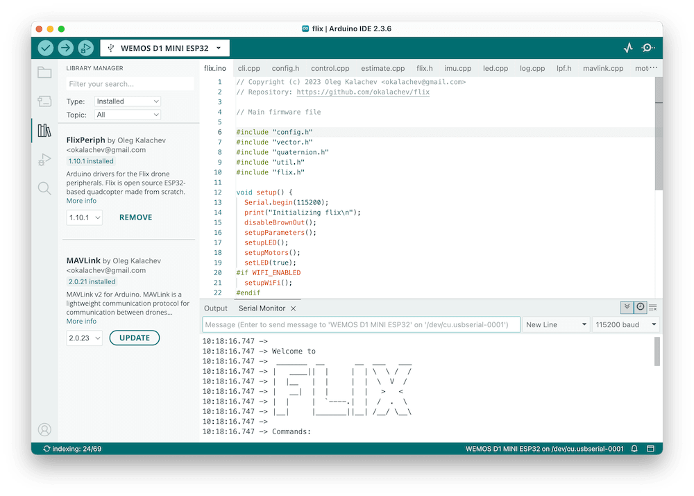

1. Install [Arduino IDE](https://www.arduino.cc/en/software) (version 2 is recommended).
2. *Windows users might need to install [USB to UART bridge driver from Silicon Labs](https://www.silabs.com/developers/usb-to-uart-bridge-vcp-drivers).*
3. Install ESP32 core, version 3.2.0. See the [official Espressif's instructions](https://docs.espressif.com/projects/arduino-esp32/en/latest/installing.html#installing-using-arduino-ide) on installing ESP32 Core in Arduino IDE.
4. Install the following libraries using [Library Manager](https://docs.arduino.cc/software/ide-v2/tutorials/ide-v2-installing-a-library):
   * `FlixPeriph`, the latest version.
   * `MAVLink`, version 2.0.16.
5. Open the `flix/flix.ino` sketch from downloaded firmware sources in Arduino IDE.
6. Connect your ESP32 board to the computer and choose correct board type in Arduino IDE (*WEMOS D1 MINI ESP32* for ESP32 Mini) and the port.
7. [Build and upload](https://docs.arduino.cc/software/ide-v2/tutorials/getting-started/ide-v2-uploading-a-sketch) the firmware using Arduino IDE.

### Command line (Windows, Linux, macOS)

1. [Install Arduino CLI](https://arduino.github.io/arduino-cli/installation/).

   On Linux, install it like this:

   ```bash
   curl -fsSL https://raw.githubusercontent.com/arduino/arduino-cli/master/install.sh | BINDIR=~/.local/bin sh
   ```

2. Windows users might need to install [USB to UART bridge driver from Silicon Labs](https://www.silabs.com/developers/usb-to-uart-bridge-vcp-drivers).
3. Compile the firmware using `make`. Arduino dependencies will be installed automatically:

   ```bash
   make
   ```

   You can flash the firmware to the board using command:

   ```bash
   make upload
   ```

   You can also compile the firmware, upload it and start serial port monitoring using command:

   ```bash
   make upload monitor
   ```

See other available Make commands in [Makefile](../Makefile).

> [!TIP]
> You can test the firmware on a bare ESP32 board without connecting IMU and other peripherals. The Wi-Fi network `flix` should appear and all the basic functionality including console and QGroundControl connection should work.

## Before first flight

### Choose the IMU model

In case if using different IMU model than MPU9250, change `imu` variable declaration in the `imu.ino`:

```cpp
ICM20948 imu(SPI);  // For ICM-20948
MPU6050 imu(Wire);  // For MPU-6050
```

### Connect using QGroundControl

QGroundControl is a ground control station software that can be used to monitor and control the drone.

1. Install mobile or desktop version of [QGroundControl](https://docs.qgroundcontrol.com/master/en/qgc-user-guide/getting_started/download_and_install.html).
2. Power up the drone.
3. Connect your computer or smartphone to the appeared `flix` Wi-Fi network (password: `flixwifi`).
4. Launch QGroundControl app. It should connect and begin showing the drone's telemetry automatically.

### Access console

The console is a command line interface (CLI) that allows to interact with the drone, change parameters, and perform various actions. There are two ways of accessing the console: using **serial port** or using **QGroundControl (wirelessly)**.

To access the console using serial port:

1. Connect the ESP32 board to the computer using USB cable.
2. Open Serial Monitor in Arduino IDE (or use `make monitor` in the command line).
3. In Arduino IDE, make sure the baudrate is set to 115200.

To access the console using QGroundControl:

1. Connect to the drone using QGroundControl app.
2. Go to the QGroundControl menu ⇒ *Vehicle Setup* ⇒ *Analyze Tools* ⇒ *MAVLink Console*.


> [!TIP]
> Use `help` command to see the list of available commands.

### Access parameters

The drone is configured using parameters. To access and modify them, go to the QGroundControl menu ⇒ *Vehicle Setup* ⇒ *Parameters*:


### Define IMU orientation

Use parameters, to define the IMU board axes orientation relative to the drone's axes: `IMU_ROT_ROLL`, `IMU_ROT_PITCH`, and `IMU_ROT_YAW`.

The drone has *X* axis pointing forward, *Y* axis pointing left, and *Z* axis pointing up, and the supported IMU boards have *X* axis pointing to the pins side and *Z* axis pointing up from the component side:

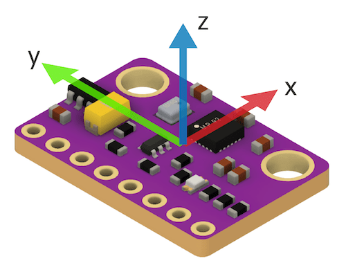

Use the following table to set the parameters for common IMU orientations:

|Orientation|Parameters|Orientation|Parameters|
|:-:|-|-|-|
|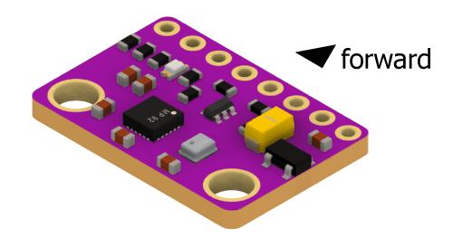|`IMU_ROT_ROLL` = 0<br>`IMU_ROT_PITCH` = 0<br>`IMU_ROT_YAW` = 0    |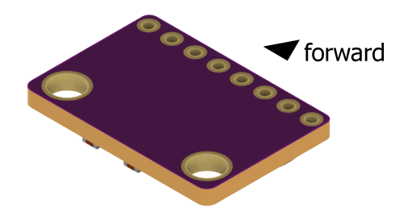|`IMU_ROT_ROLL` = 3.142<br>`IMU_ROT_PITCH` = 0<br>`IMU_ROT_YAW` = 0|
|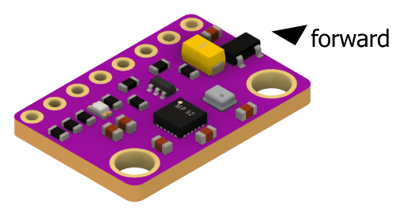|`IMU_ROT_ROLL` = 0<br>`IMU_ROT_PITCH` = 0<br>`IMU_ROT_YAW` = 1.571|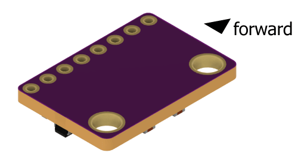|`IMU_ROT_ROLL` = 3.142<br>`IMU_ROT_PITCH` = 0<br>`IMU_ROT_YAW` = -1.571|
|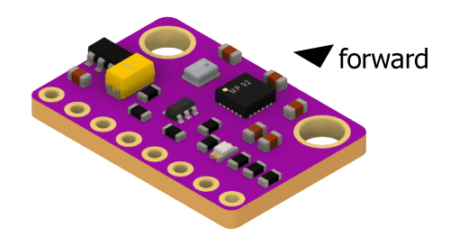|`IMU_ROT_ROLL` = 0<br>`IMU_ROT_PITCH` = 0<br>`IMU_ROT_YAW` = 3.142|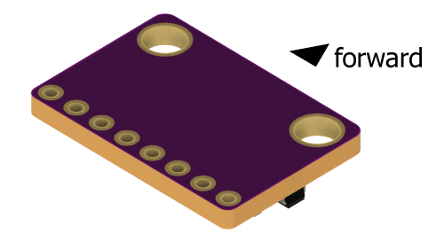|`IMU_ROT_ROLL` = 3.142<br>`IMU_ROT_PITCH` = 0<br>`IMU_ROT_YAW` = 3.142|
|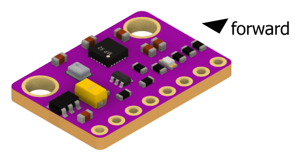<br>☑️ **Default**|<br>`IMU_ROT_ROLL` = 0<br>`IMU_ROT_PITCH` = 0<br>`IMU_ROT_YAW` = -1.571|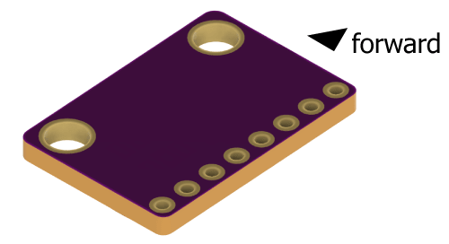|`IMU_ROT_ROLL` = 3.142<br>`IMU_ROT_PITCH` = 0<br>`IMU_ROT_YAW` = 1.571|

### Calibrate accelerometer

Before flight you need to calibrate the accelerometer:

1. Access the console using QGroundControl (recommended) or Serial Monitor.
2. Type `ca` command there and follow the instructions.

### Check everything works

1. Check the IMU is working: perform `imu` command and check its output:

   * The `status` field should be `OK`.
   * The `rate` field should be about 1000 (Hz).
   * The `accel` and `gyro` fields should change as you move the drone.
   * The `landed` field should be `1` when the drone is still on the ground and `0` when you lift it up.

2. Check the attitude estimation: connect to the drone using QGroundControl, rotate the drone in different orientations and check if the attitude estimation shown in QGroundControl is correct. Attitude indicator in QGroundControl is shown below:

   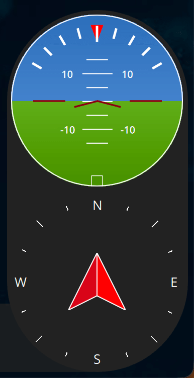

3. Perform motor tests in the console. Use the following commands **— remove the propellers before running the tests!**

   * `mfr` — should rotate front right motor (counter-clockwise).
   * `mfl` — should rotate front left motor (clockwise).
   * `mrl` — should rotate rear left motor (counter-clockwise).
   * `mrr` — should rotate rear right motor (clockwise).

   Rotation diagram:

   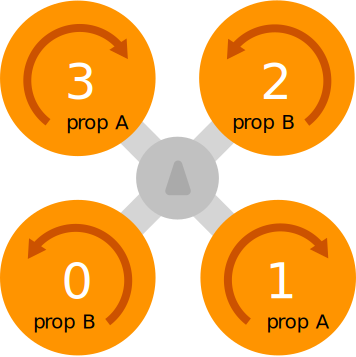

> [!WARNING]
> Never run the motors when powering the drone from USB, always use the battery for that.

## Setup remote control

There are several ways to control the drone's flight: using **smartphone** (Wi-Fi), using **SBUS remote control**, or using **USB remote control** (Wi-Fi).

### Control with smartphone

1. Install [QGroundControl mobile app](https://docs.qgroundcontrol.com/master/en/qgc-user-guide/getting_started/download_and_install.html#android) on your smartphone.
2. Power the drone using the battery.
3. Connect your smartphone to the appeared `flix` Wi-Fi network (password: `flixwifi`).
4. Open QGroundControl app. It should connect and begin showing the drone's telemetry automatically.
5. Go to the settings and enable *Virtual Joystick*. *Auto-Center Throttle* setting **should be disabled**.
6. Use the virtual joystick to fly the drone!

> [!TIP]
> Decrease `CTL_TILT_MAX` parameter when flying using the smartphone to make the controls less sensitive.

### Control with remote control

Before using remote SBUS-connected remote control, you need to calibrate it:

1. Access the console using QGroundControl (recommended) or Serial Monitor.
2. Type `cr` command and follow the instructions.
3. Use the remote control to fly the drone!

### Control with USB remote control

If your drone doesn't have RC receiver installed, you can use USB remote control and QGroundControl app to fly it.

1. Install [QGroundControl](https://docs.qgroundcontrol.com/master/en/qgc-user-guide/getting_started/download_and_install.html) app on your computer.
2. Connect your USB remote control to the computer.
3. Power up the drone.
4. Connect your computer to the appeared `flix` Wi-Fi network (password: `flixwifi`).
5. Launch QGroundControl app. It should connect and begin showing the drone's telemetry automatically.
6. Go the the QGroundControl menu ⇒ *Vehicle Setup* ⇒ *Joystick*. Calibrate you USB remote control there.
7. Use the USB remote control to fly the drone!

## Flight

For both virtual sticks and a physical joystick, the default control scheme is left stick for throttle and yaw and right stick for pitch and roll:


### Arming and disarming

To start the motors, you should **arm** the drone. To do that, move the left stick to the bottom right corner:


After that, the motors **will start spinning** at low speed, indicating that the drone is armed and ready to fly.

When finished flying, **disarm** the drone, moving the left stick to the bottom left corner:


> [!NOTE]
> If something goes wrong, go to the [Troubleshooting](troubleshooting.md) article.

### Flight modes

Flight mode is changed using mode switch on the remote control or using the command line.

#### STAB

The default mode is *STAB*. In this mode, the drone stabilizes its attitude (orientation). The left stick controls throttle and yaw rate, the right stick controls pitch and roll angles.

> [!IMPORTANT]
> The drone doesn't stabilize its position, so slight drift is possible. The pilot should compensate it manually.

#### ACRO

In this mode, the pilot controls the angular rates. This control method is difficult to fly and mostly used in FPV racing.

#### RAW

*RAW* mode disables all the stabilization, and the pilot inputs are mixed directly to the motors. The IMU sensor is not involved. This mode is intended for testing and demonstration purposes only, and basically the drone **cannot fly in this mode**.

#### AUTO

In this mode, the pilot inputs are ignored (except the mode switch, if configured). The drone can be controlled using [pyflix](../tools/pyflix/) Python library, or by modifying the firmware to implement the needed autonomous behavior.

If the pilot moves the control sticks, the drone will switch back to *STAB* mode.

## Flight log

After the flight, you can download the flight log for analysis wirelessly. Use the following for that:

```bash
make log
```

See more details about log analysis in the [log analysis](log.md) article.
