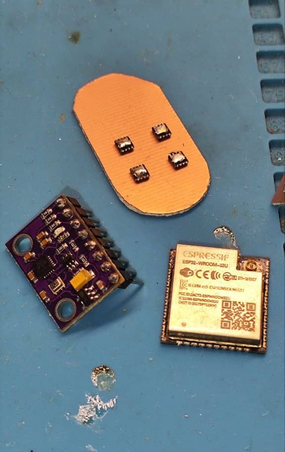
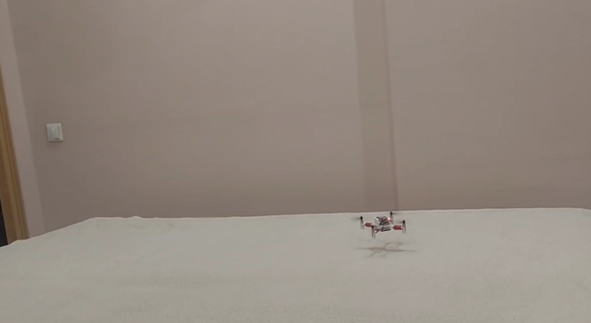

# Hall of fame

This page contains user-built drones based on the Flix project. Publish your projects into the official Telegram-chat: [@opensourcequadcopterchat](https://t.me/opensourcequadcopterchat) or send materials as a pull request.

---

Author: [@cryptokobans](https://t.me/cryptokobans). 
Features: ESP32-C3 SuperMini board, INA226 power monitor, IRLZ44N MOSFETs, MPU-6500 IMU.

**Flight video:**

 

---

Author: [@jeka_chex](https://t.me/jeka_chex). 
Features: custom frame, FPV camera, 3-blade 31 mm propellers. 
Motor drivers: AON7410 MOSFET + capacitors. 
Custom frame files: https://drive.google.com/drive/folders/1QCIc-_YYFxJN4cMhVLjL5SflqegvCowm?usp=share_link. 

**Flight video:**

**FPV flight video:**

    

---

Author: [@fisheyeu](https://t.me/fisheyeu). 
[Video](https://drive.google.com/file/d/1IT4eMmWPZpmaZR_qsIRmNJ52hYkFB_0q/view?usp=share_link).

 

---

Author: [@p_kabakov](https://t.me/p_kabakov). 
Custom propellers guard 3D-model: https://drive.google.com/file/d/1TKnzwvrZYzYuRTLLERNmnKH71H9n4Xj_/view?usp=share_link. 
Features: ESP32-C3 microcontroller is used. 
[Video](https://drive.google.com/file/d/1B0NMcsk0fgwUgNr9XuLOdR2yYCuaj008/view?usp=share_link).

  

**Custom Wi-Fi RC control:**

See source and description (in Russian): https://github.com/pavelkabakov/flix/tree/master/rc_control_v1.

---

Author: [@yi_lun](https://t.me/yi_lun). 
[Video](https://drive.google.com/file/d/1TkSuvHQ_0qQPFUpY5XjJzmhnpX_07cTg/view?usp=share_link).

 

---

Author: [@peter_ukhov](https://t.me/peter_ukhov). 
Features: customized ESP32 holder, GY-ICM20948V2 IMU board, boost-converter for powering the ESP32. 
Files for 3D-printing: https://drive.google.com/file/d/1Sma-FEzFBj2HA5ixJtUyH0uWixvr6vdK/view?usp=share_link. 
Schematics: https://miro.com/app/board/uXjVN-dTjoo=/?moveToWidget=3458764612179508274&cot=14. 

 

---

Author: [@Alexey_Karakash](https://t.me/Alexey_Karakash). 
Files for 3D printing of the custom frame: https://drive.google.com/file/d/1tkNmujrHrKpTMVtsRH3mor2zdAM0JHum/view?usp=share_link. 

    

---

Author: [@rudpa](https://t.me/rudpa). 

  

---

Author: [@peter_ukhov](https://t.me/peter_ukhov). 
Schematics: https://miro.com/app/board/uXjVN-dTjoo=/?moveToWidget=3458764612338222067&cot=14. 

  
