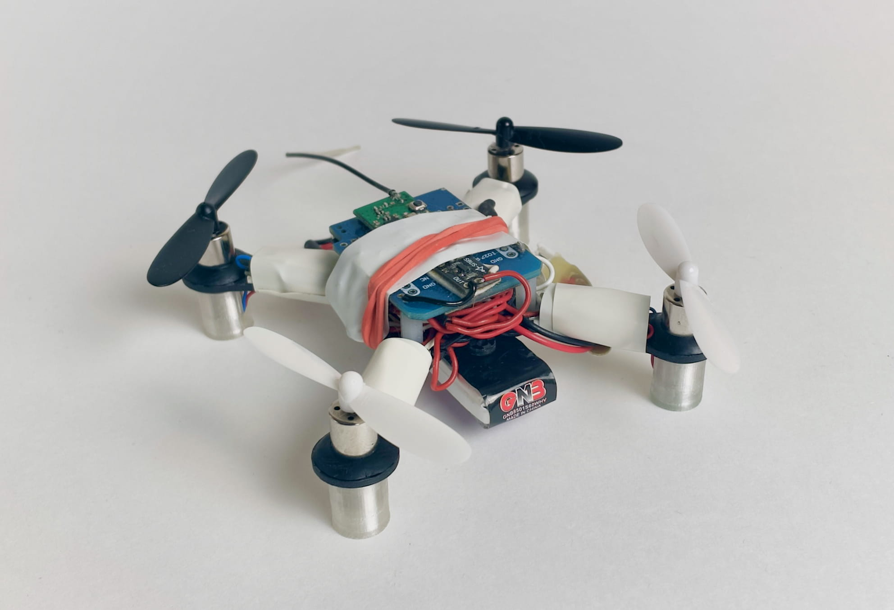
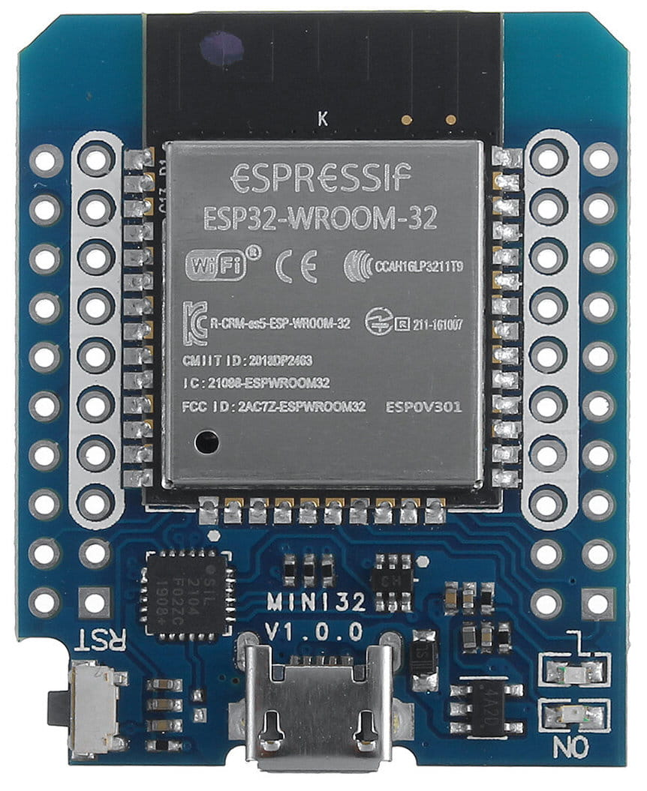
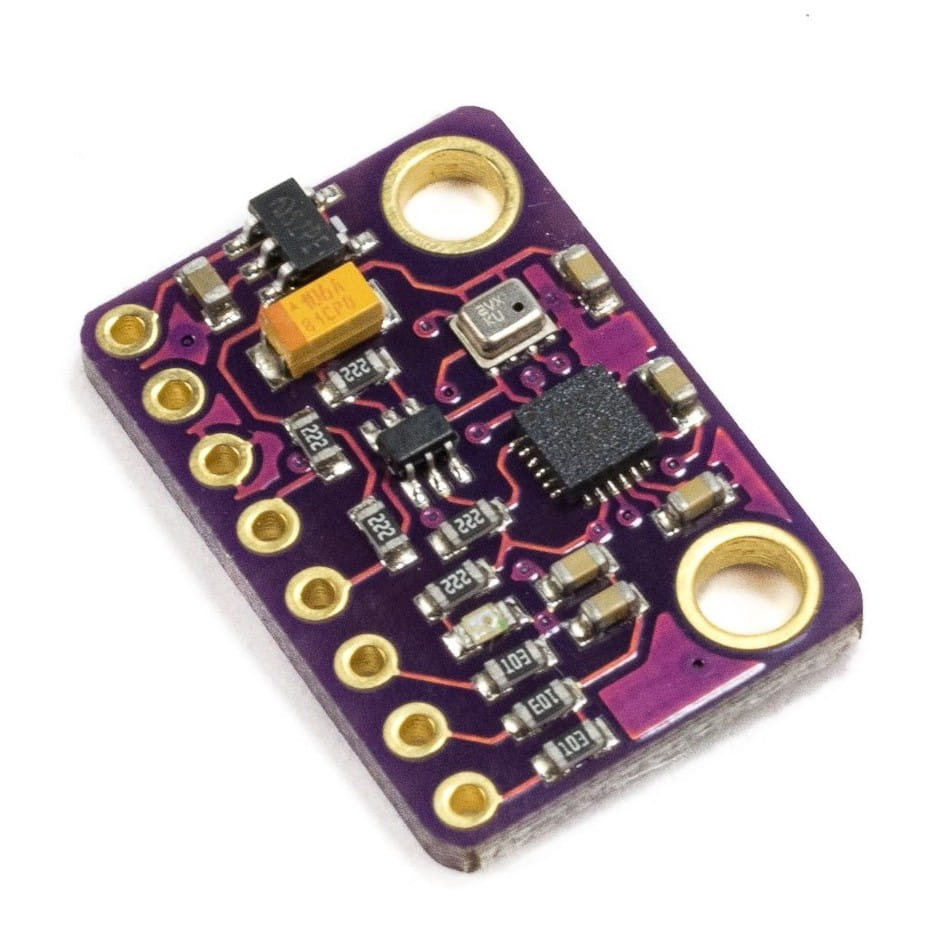
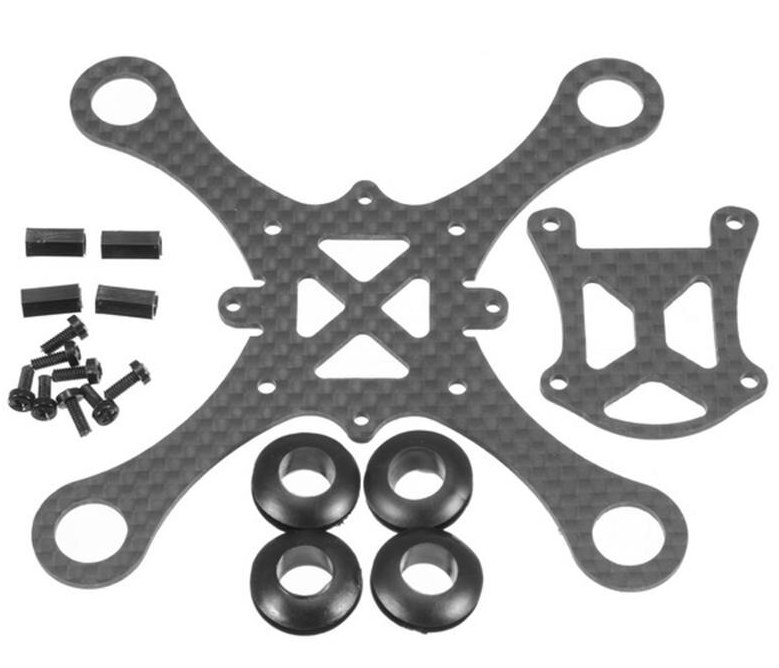
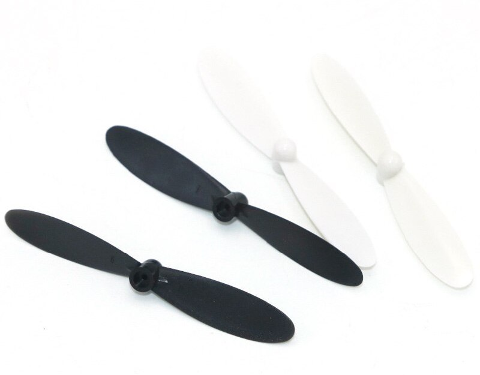
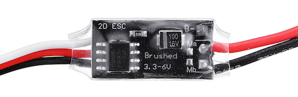
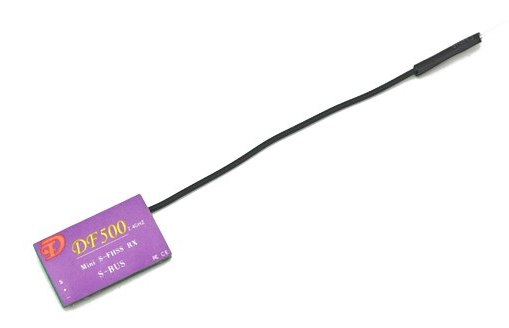
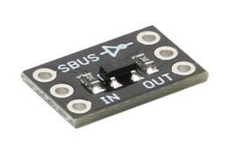
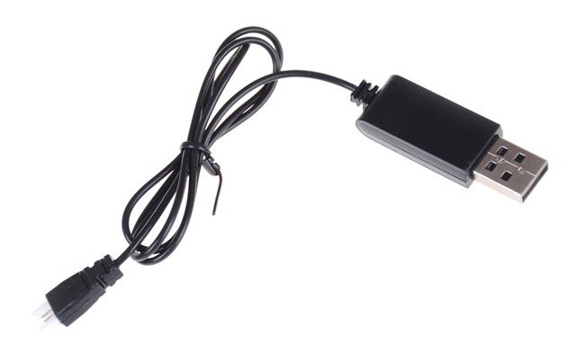
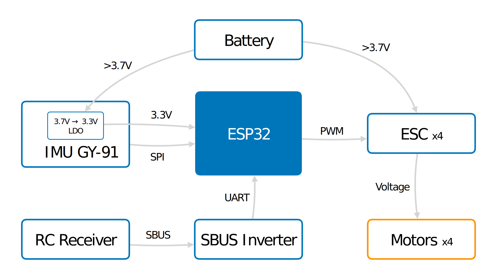

# Flix version 0

Flix version 0 (obsolete):

## Components list

|Type|Part|Image|Quantity|
|-|-|-|-|
|Microcontroller board|ESP32 Mini||1|
|IMU and barometer² board|GY-91 (or other MPU-9250 board)||1|
|Quadcopter frame|K100||1|
|Motor|8520 3.7V brushed motor (**shaft 0.8mm!**)||4|
|Propeller|Hubsan 55 mm||4|
|Motor ESC|2.7A 1S Dual Way Micro Brush ESC||4|
|RC transmitter|KINGKONG TINY X8||1|
|RC receiver|DF500 (SBUS)||1|
|~~SBUS inverter~~*|||~~1~~|
|Battery|3.7 Li-Po 850 MaH 60C|||
|Battery charger|||1|
|Wires, connectors, tape, ...||||

*\* — not needed as ESP32 supports [software pin inversion](https://github.com/bolderflight/sbus#inverted-serial).*

## Schematics

You can also check a user contributed [variant of complete circuit diagram](https://miro.com/app/board/uXjVN-dTjoo=/?moveToWidget=3458764574482511443&cot=14) of the drone.
