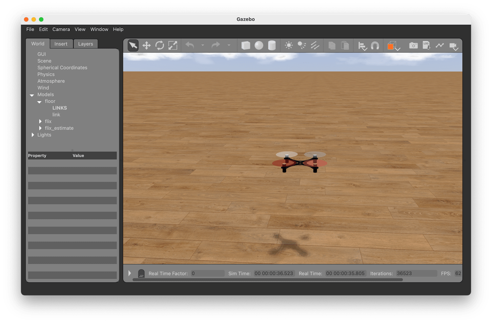

# Gazebo Simulation

## Building and running

See [building and running instructions](../docs/usage.md#simulation).

## Code structure

Flix simulator is based on [Gazebo Classic](https://classic.gazebosim.org) and consists of the following components:

* Physical model of the drone: [`models/flix/flix.sdf`](models/flix/flix.sdf).
* Plugin for Gazebo: [`simulator.cpp`](simulator.cpp). The plugin is attached to the physical model. It receives stick positions from the controller, gets the data from the virtual sensors, and then passes this data to the Arduino code.
* Arduino imitation: [`Arduino.h`](Arduino.h). This file contains partial implementation of the Arduino API, that is working within Gazebo plugin environment.
