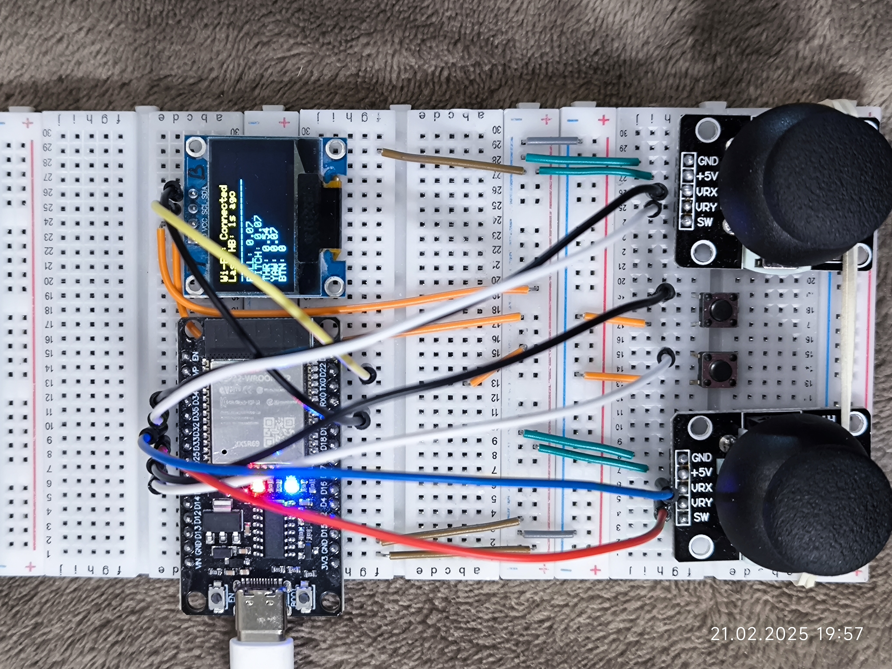

# Простой пульт дистанционного управления на ESP32

Простой пульт дистанционного управления на микроконтроллере **ESP32** с двумя джойстиками, двумя кнопками *(пока не активны в прошивке)* и экраном **OLED SSD1306 128x64**.  
Соединение происходит посредством **WiFi**, управляющие команды передаются по протоколу **MAVLink**.

---

## A Simple Remote Control on ESP32

A simple remote control on an **ESP32** microcontroller with two joysticks, two buttons *(currently inactive in the firmware)*, and an **OLED SSD1306 128x64** display.  
The connection is established via **WiFi**, and control commands are transmitted using the **MAVLink** protocol.

---

## 📷 Пример реализации / Implementation Example

