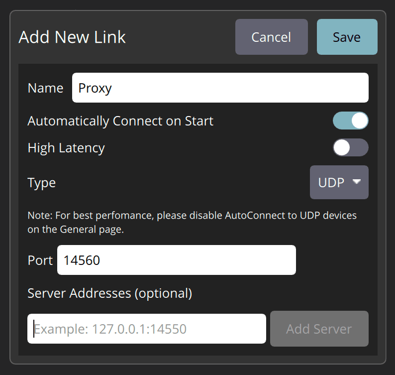

# Flix Python library

The Flix Python library allows you to remotely connect to a Flix quadcopter. It provides access to telemetry data, supports executing CLI commands, and controlling the drone's flight.

To use the library, connect to the drone's Wi-Fi. To use it with the simulator, ensure the script runs on the same local network as the simulator.

## Installation

If you have cloned the [repo](https://github.com/okalachev/flix), install the library from the repo:

```bash
cd /path/to/flix/repo
pip install -e tools
```

Alternatively, install from pip:

```bash
pip install pyflix
```

## Usage

The API is accessed through the `Flix` class:

```python
from flix import Flix
flix = Flix()  # create a Flix object and wait for connection
```

### Telemetry

Basic telemetry is available through object properties. The properties names generally match the corresponding variables in the firmware itself:

```python
print(flix.connected)       # True if connected to the drone
print(flix.mode)            # current flight mode (str)
print(flix.armed)           # True if the drone is armed
print(flix.landed)          # True if the drone is landed
print(flix.attitude)        # attitude quaternion [w, x, y, z]
print(flix.attitude_euler)  # attitude as Euler angles [roll, pitch, yaw]
print(flix.rates)           # angular rates [roll_rate, pitch_rate, yaw_rate]
print(flix.channels)        # raw RC channels (list)
print(flix.motors)          # motors outputs (list)
print(flix.acc)             # accelerometer output (list)
print(flix.gyro)            # gyroscope output (list)
```

> [!NOTE]
> The library uses the Front-Left-Up coordinate system — the same as in the firmware. All angles are in radians.

### Events

The Flix object implements the *Observable* pattern, allowing to listen for events. You can subscribe to events using `on` method:

```python
flix.on('connected', lambda: print('Connected to Flix'))
flix.on('disconnected', lambda: print('Disconnected from Flix'))
flix.on('print', lambda text: print(f'Flix says: {text}'))
```

Unsubscribe from events using `off` method:

```python
flix.off('print')  # unsubscribe from print events
flix.off(callback)  # unsubscribe specific callback
```

You can also wait for specific events using `wait` method. This method returns the data associated with the event:

```python
gyro = flix.wait('gyro')  # wait for gyroscope update
attitude = flix.wait('attitude', timeout=3)  # wait for attitude update, raise TimeoutError after 3 seconds
```

The second argument (`value`) specifies a condition for filtering events. It can be either an expected value or a callable:

```python
flix.wait('armed', True)  # wait until armed
flix.wait('armed', False)  # wait until disarmed
flix.wait('mode', 'AUTO')  # wait until flight mode is switched to AUTO
flix.wait('motors', lambda motors: not any(motors))  # wait until all motors stop
flix.wait('attitude_euler', lambda att: att[0] > 0)  # wait until roll angle is positive
```

Full list of events:

|Event|Description|Associated data|
|-----|-----------|----------------|
|`connected`|Connected to the drone||
|`disconnected`|Connection is lost||
|`armed`|Armed state update|Armed state (*bool*)|
|`mode`|Flight mode update|Flight mode (*str*)|
|`landed`|Landed state update|Landed state (*bool*)|
|`print`|The drone sends text to the console|Text|
|`attitude`|Attitude update|Attitude quaternion (*list*)|
|`attitude_euler`|Attitude update|Euler angles (*list*)|
|`rates`|Angular rates update|Angular rates (*list*)|
|`channels`|Raw RC channels update|Raw RC channels (*list*)|
|`motors`|Motors outputs update|Motors outputs (*list*)|
|`acc`|Accelerometer update|Accelerometer output (*list*)|
|`gyro`|Gyroscope update|Gyroscope output (*list*)|
|`mavlink`|Received MAVLink message|Message object|
|`mavlink.<message_name>`|Received specific MAVLink message|Message object|
|`mavlink.<message_id>`|Received specific MAVLink message|Message object|
|`value`|Named value update (see below)|Name, value|
|`value.<name>`|Specific named value update (see bellow)|Value|

> [!NOTE]
> Update events trigger on every new data from the drone, and do not mean the value is changed.

### Common methods

Get and set firmware parameters using `get_param` and `set_param` methods:

```python
pitch_p = flix.get_param('PITCH_P')  # get parameter value
flix.set_param('PITCH_P', 5)         # set parameter value
```

Execute CLI commands using `cli` method. This method returns command response:

```python
imu = flix.cli('imu')    # get detailed IMU data
time = flix.cli('time')  # get detailed time data
flix.cli('reboot')       # reboot the drone
```

> [!TIP]
> Use `help` command to get the list of available commands.

You can arm and disarm the drone using `set_armed` method (warning: the drone will fall if disarmed in the air):

```python
flix.set_armed(True)   # arm the drone
flix.set_armed(False)  # disarm the drone
```

You can imitate pilot's controls using `set_controls` method:

```python
flix.set_controls(roll=0, pitch=0, yaw=0, throttle=0.6)
```

> [!WARNING]
> This method **is not intended for automatic flights**, only for adding support for a custom pilot input device.

### Automatic flight

To perform automatic flight, switch the mode to *AUTO*, either from the remote control, or from the code:

```python
flix.set_mode('AUTO')
```

In this mode you can set flight control targets. Setting attitude target:

```python
flix.set_attitude([0.1, 0.2, 0.3], 0.6)  # set target roll, pitch, yaw and thrust
flix.set_attitude([1, 0, 0, 0], 0.6)  # set target attitude quaternion and thrust
```

Setting angular rates target:

```python
flix.set_rates([0.1, 0.2, 0.3], 0.6)  # set target roll rate, pitch rate, yaw rate and thrust
```

You also can control raw motors outputs directly:

```python
flix.set_motors([0.5, 0.5, 0.5, 0.5])  # set motors outputs in range [0, 1]
```

In *AUTO* mode, the drone will arm automatically if the thrust is greater than zero, and disarm if thrust is zero. Therefore, to disarm the drone, set thrust to zero:

```python
flix.set_attitude([0, 0, 0], 0)  # disarm the drone
```

The following methods are in development and are not functional yet:

* `set_position` — set target position.
* `set_velocity` — set target velocity.

To exit from *AUTO* mode move control sticks and the drone will switch to *STAB* mode.

## Usage alongside QGroundControl

You can use the Flix library alongside the QGroundControl app, using proxy mode. To do that:

1. Run proxy for `pyflix` and QGroundControl in background:

   ```bash
   flix-proxy
   ```

2. Go to QGroundControl settings ⇒ *Comm Links*.
3. Add new link with the following settings:
   * *Name*: Proxy
   * *Automatically Connect on Start*: ✓
   * *Type*: UDP
   * *Port*: 14560
4. Restart QGroundControl.



Now you can run `pyflix` scripts and QGroundControl simultaneously.

## Tools

The following scripts demonstrate how to use the library:

* [`cli.py`](../cli.py) — remote access to the drone's command line interface.
* [`log.py`](../log.py) — download flight logs from the drone.
* [`example.py`](../example.py) — a simple example, prints telemetry data and waits for events.

## Advanced usage

### MAVLink

You can access the most recently received messages using `messages` property:

```python
print(flix.messages.get('HEARTBEAT'))  # print the latest HEARTBEAT message
```

You can wait for a specific message using `wait` method:

```python
heartbeat = flix.wait('mavlink.HEARTBEAT')
```

You can send raw messages using `mavlink` property:

```python
from pymavlink.dialects.v20 import common as mavlink

flix.mavlink.heartbeat_send(mavlink.MAV_TYPE_GCS, mavlink.MAV_AUTOPILOT_INVALID,
                            mavlink.MAV_MODE_FLAG_CUSTOM_MODE_ENABLED, 0, 0)
```

### Named values

You can pass arbitrary named values from the firmware to the Python script using `NAMED_VALUE_FLOAT`, `NAMED_VALUE_INT`, `DEBUG`, `DEBUG_VECT`, and `DEBUG_FLOAT_ARRAY` MAVLink messages.

All these named values will appear in the `values` dictionary:

```python
print(flix.values['some_value'])
print(flix.values['some_vector'])
```

You can send values from the firmware like this (`mavlink.ino`):

```cpp
// Send float named value
mavlink_msg_named_value_float_pack(SYSTEM_ID, MAV_COMP_ID_AUTOPILOT1, &msg, t, "loop_rate", loopRate);
sendMessage(&msg);

// Send vector named value
mavlink_msg_debug_vect_pack(SYSTEM_ID, MAV_COMP_ID_AUTOPILOT1, &msg, "gyro_bias", t, gyroBias.x, gyroBias.y, gyroBias.z);
sendMessage(&msg);
```

### Logging

You can control Flix library verbosity using Python's `logging` module:

```python
import logging

logger = logging.getLogger('flix')
logger.setLevel(logging.DEBUG)  # be more verbose
logger.setLevel(logging.WARNING)  # be less verbose
```

## Stability

The library is in development stage. The API is not stable.
